# Тема 10. Декораторы и исключения
Отчет по Теме #10 выполнила:
- Серкина Ксения Кирилловна
- ПИЭ-23-1

| Задание | Лаб_раб | Сам_раб |
| ------ |---------|---------|
| Задание 1 | +       | +       |
| Задание 2 | +       | +       |
| Задание 3 | +       | +       |
| Задание 4 | +       | +       |
| Задание 5 | +       | +       |

знак "+" - задание выполнено; знак "-" - задание не выполнено;

Работу проверили:
- к.э.н., доцент Панов М.А.

## Лабораторная работа №1
### Наверняка вы думаете, что декораторы – это какая-то бесполезная вещь, которая вам никогда не пригодится, но тут вдруг на паре по математике преподаватель просит всех посчитать число Фибоначчи для 100. Кто-то будет считать вручную (так точно не нужно), кто-то посчитает на калькуляторе, а кто-то подумает, что он самый крутой и напишет рекурсивную программу на Python и немного огорчится, потому что данная программа будет достаточно долго считаться, если ее просто так запускать. Но именно тут к вам на помощь приходят декораторы, например @lru_cache (он предназначен для решения задач динамическим программированием, если простыми словами, то этот декоратор запоминает промежуточные результаты и при рекурсивном вызове функции программа не будет считать одни и те же значения, а просто “возьмёт их из этого декоратора”). Вам нужно написать программу, которая будет считать числа Фибоначчи для 100 и запустить ее без этого декоратора и с ним, посмотреть на разницу во времени решения поставленной задачи. P.S. при запуске без декоратора можете долго не ждать, для наглядности хватит 10 секунд ожидания.

```python
from functools import lru_cache

@lru_cache(None)
def fibonacci(n):
    if n == 0:
        return 0
    elif n == 1:
        return 1
    return fibonacci(n - 1) + fibonacci(n - 2)

print(fibonacci(100))
```
### Результат.

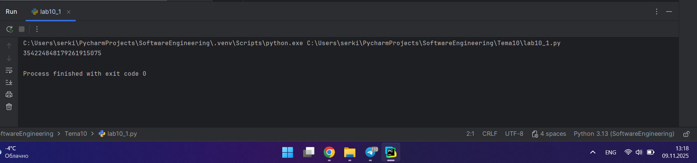

### Выводы

Мы воспользовались декоратором @lru_cache() модуля functools, который оборачивает функцию с переданными в нее аргументами и запоминает возвращаемый результат соответствующий этим аргументам. Такое поведение может сэкономить время и ресурсы, когда дорогая или связанная с вводом/выводом функция периодически вызывается с одинаковыми аргументами. В нашем случае это использовалось для подчёта числа фибоначчи.

## Лабораторная работа №2
### Илья пишет свой сайт и ему необходимо сделать минимальную проверку ввода данных пользователя при регистрации. Для этого он реализовал функцию, которая выводит данные пользователя на экран и решил, что будет проверять правильность введённых данных при помощи декоратора, но в этом ему потребовалась ваша помощь. Напишите декоратор для функции, который будет принимать все параметры вызываемой функции (имя, возраст) и проверять чтобы возраст был больше 0 и меньше 130. Причем заметьте, что неважно сколько пользователь введет данных на сайт к Илье, будут обрабатываться только первые 2 аргумента.

```python
def check(input_func):
    def output_func(*args):
        name, age = args[0], args[1]
        if age < 0 or age > 130:
            age = 'Недопустимый возраст'
        input_func(name, age)

    return output_func

@check
def personal_info(name, age):
    print(f"Name: {name} Age: {age}")

personal_info('Владимир', 38)
personal_info('Александр', -5)
personal_info('Петр', 138, 15, 48, 2)
```
### Результат.

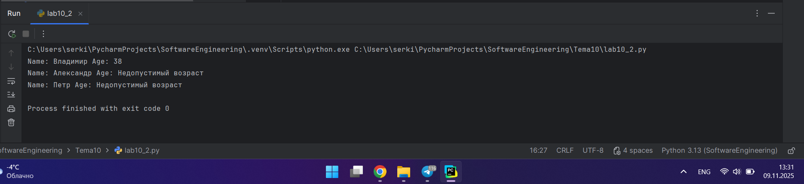

### Выводы

Здесь функция personal_info() принимает два параметра: name (имя) и age (возраст). К этой функции применяется декоратор check(). В декораторе check возвращается локальная функция output_func(), которая принимает некоторый набор значений в виде параметра *args - это те значения, которые передаются в оригинальную функцию, к которой применяется декоратор. То есть в данном случае *args будет содержать значения параметров name и age.

## Лабораторная работа №3
### Вам понравилась идея Ильи с сайтом, и вы решили дальше работать вместе с ним. Но вот в вашем проекте появилась проблема, кто-то пытается сломать вашу функцию с получением данных для сайта. Эта функция работает только с данными integer, а какой-то недохакер пытается все сломать и вместо нужного типа данных отправляет string. Воспользуйтесь исключениями, чтобы неподходящий тип данных не ломал ваш сайт. Также дополнительно можете обернуть весь код функции в try/except/finally для того, чтобы программа вас оповестила о том, что выявлена какая-то ошибка или программа успешно выполнена.

```python
def data(*args):
    try:
        for i in range(len(*args)):
            try:
                result = (args[0][i] * 15) // 10
                print(result)
            except Exception as ex:
                print(ex)
    except Exception as ex:
        print(ex)
    finally:
        print('Вся информация обработана')

if __name__ == '__main__':
    data([1, 15, 'Hello', 'i', 'try', 'to', 'crash', 'your', 'site', 38, 45])
```
### Результат.

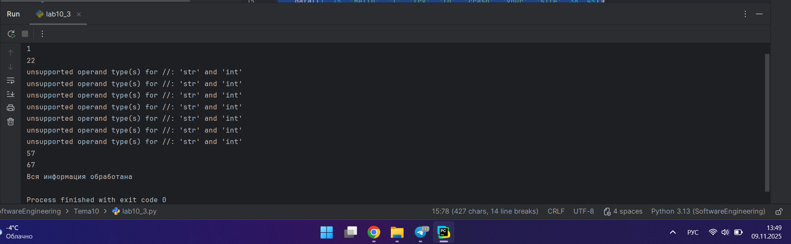

### Выводы

Для обработки исключений мы используем конструкцию except Exception as ex  для обработки исключений, которая перехватывает любые стандартные ошибки (исключения), происходящие в блоке try. Exception — это базовый класс для большинства исключений, а ex — это переменная, в которую сохраняется информация об объекте исключения. В нашем случае он обрабатывает string значения и выводит как ошибку, но не вызывает прекращение работы программы.
  
## Лабораторная работа №4
### Продолжая работу над сайтом, вы решили написать собственное исключение, которое будет вызываться в случае, если в функцию проверки имени при регистрации передана строка длиннее десяти символов, а если имя имеет допустимую длину, то в консоль выводиться “Успешная регистрация”

```python
class NegativeValueException(Exception):
    pass

def check_name(name):
    if len(name) > 10:
        raise NegativeValueException('Длина более 10 символов')
    else:
        print('Успешная регистрация')

if __name__ == '__main__':
    name = '12345678900'
    check_name(name)
```
### Результат.

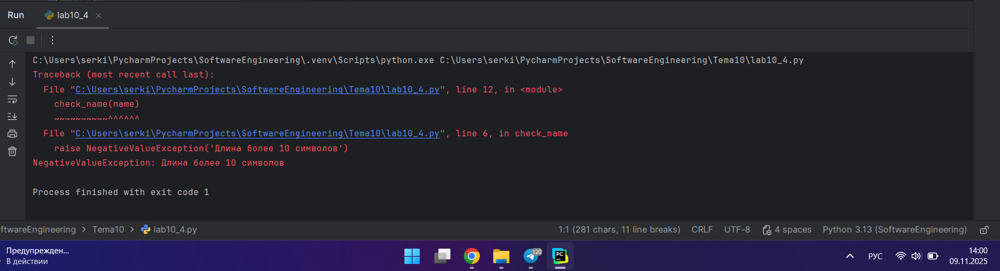

### Выводы

В нашем коде мы используем команду raise для принудительного вызова исключения, вместе с исключением NegativeValueException(), которое выдается, если значение аргумента не соответствует допустимому диапазону значений, установленному вызванным методом.

## Лабораторная работа №5
### После запуска сайта вы поняли, что вам необходимо добавить логгер, для отслеживания его работы. Готовыми вариантами вы не захотели пользоваться, и поэтому решили создать очень простую пародию. Для этого создали две функции: __init__() (вызывается при создании класса декоратора в программе) и __call__() (вызывается при вызове декоратора). Создайте необходимый вам декоратор. Выведите все логи в консоль.

```python
class SiteChecker:
    def __init__(self, func):
        print('> Класс SiteChecker метод __init__ успешный запуск')
        self.func = func

    def __call__(self):
        print('> Проверка перед запуском', self.func.__name__)
        self.func()
        print('> Проверка безопасного выключения')

@SiteChecker
def site():
    print('Усердная работа сайта')

if __name__ == '__main__':
    print('>> Сайт запущен')
    site()
    print('>> Сайт выключен')
```
### Результат.

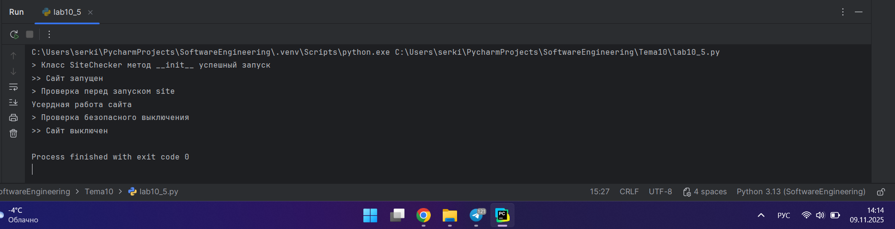

### Выводы

Данный код сначала запускает декоратор @SiteChecker, а потом запускается функция site(). Но по факту вместо функции site(), так как она помещена в декоратор, вызывается объект SiteChecker и функция __call__. 

## Самостоятельная работа №1
### Вовочка решил заняться спортивным программированием на python, но для этого он должен знать за какое время выполняется его программа. Он решил, что для этого ему идеально подойдет декоратор для функции, который будет выяснять за какое время выполняется та или иная функция. Помогите Вовочке в его начинаниях и напишите такой декоратор. Подсказка: необходимо использовать модуль time. Результатом вашей работы будет листинг кода и скриншот консоли, в котором будет выполненная функция Фибоначчи и время выполнения программы. Также на этом примере можете посмотреть, что решение задач через рекурсию не всегда является хорошей идеей. Поскольку решение Фибоначчи для 100 с использованием рекурсии и без динамического программирования решается более десяти секунд, а решение точно такой же задачи, но через цикл for еще и для 200, занимает меньше 1 секунды.

```python
import time
def timer(func):
    def wrapper():
        start_time = time.time()
        func()
        end_time = time.time()
        print(f"\nВремя выполнения: {end_time - start_time:.6f} секунд")

    return wrapper

@timer
def fibonacci():
    fib1 = fib2 = 1
    print(fib1, fib2, end=' ')

    for i in range(2, 200):
        fib1, fib2 = fib2, fib1 + fib2
        print(fib2, end=' ')

if __name__ == '__main__':
    fibonacci()
```
### Результат.

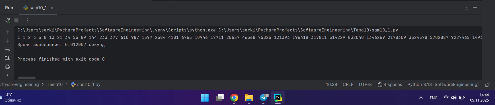

### Выводы

Создаем декоратор @timer для вычисления времени выполнения функции fibonacci(): 
1. Запускается декоратор и устанавливается начальное время;
2. Выполняется функция fibonacci();
3. Записывается конечное время;
4. Выводиться результат.
  
## Самостоятельная работа №2
### Посмотрев на Вовочку, вы также загорелись идеей спортивного программирования, начав тренировки вы узнали, что для решения некоторых задач необходимо считывать данные из файлов. Но через некоторое время вы столкнулись с проблемой что файлы бывают пустыми, и вы не получаете вводные данные для решения задачи. После этого вы решили не просто считывать данные из файла, а всю конструкцию оборачивать в исключения, чтобы избежать такой проблемы. Создайте пустой файл и файл, в котором есть какая-то информация. Напишите код программы. Если файл пустой, то, нужно вызвать исключение ("бросить исключение") и вывести в консоль "файл пустой", а если он не пустой, то вывести информацию из файла.

```python
def read_file_content(filename):
    try:
        with open(filename, 'r', encoding='utf-8') as file:
            content = file.read()
            if not content.strip():
                raise Exception("файл пустой")
            print(f"Содержимое файла: {content}")
    except FileNotFoundError:
        print("Файл не найден")
    except Exception as e:
        print(e)

if __name__ == '__main__':
    read_file_content('txt1.txt')
    read_file_content('txt2.txt')
```
### Результат.

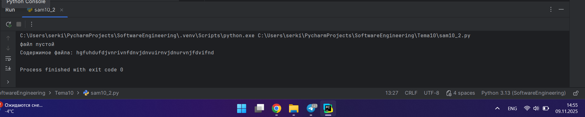

### Содержимое файлов

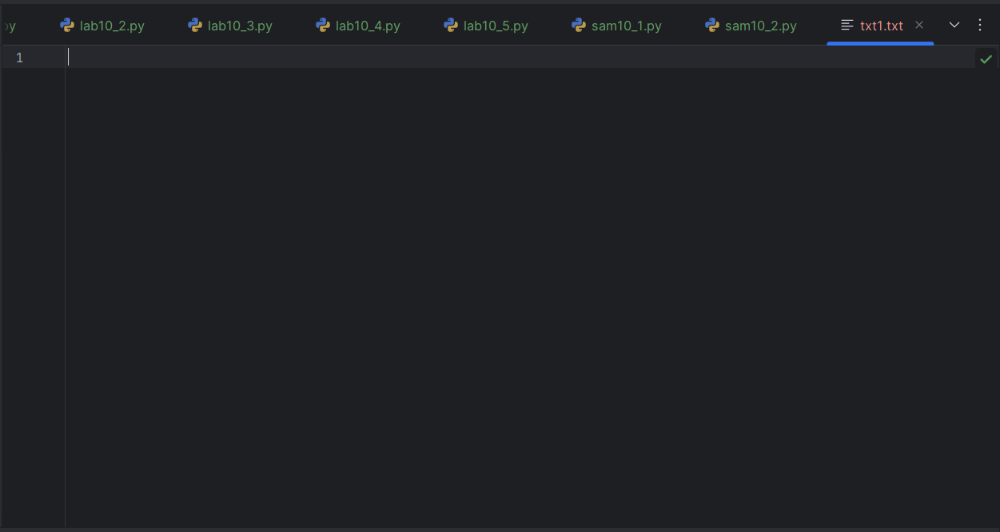
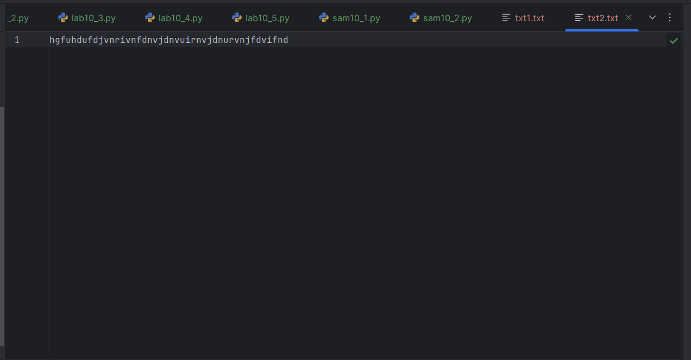

### Выводы

В данной программе мы обрабатываем исключение:
1. Файл пустой, для этого вызываем исключение raise Exception("файл пустой");
2. Если исключение не вызвалось, выводим содердимое файла;
3. Проверяем, что файл существует except FileNotFoundError;
4. В случае если будут вызваны другие исключения также их обрабатываем except Exception as e.
  
## Самостоятельная работа №3
### Напишите функцию, которая будет складывать 2 и введенное пользователем число, но если пользователь введет строку или другой неподходящий тип данных, то в консоль выведется ошибка "Неподходящий тип данных. Ожидалось число.". Реализовать функционал программы необходимо через try/except и подобрать правильный тип исключения. Создавать собственное исключение нельзя. Проведите несколько тестов, в которых исключение вызывается и нет. Результатом выполнения задачи будет листинг кода и получившийся вывод в консоль

```python
def add_two():
    try:
        user_input = input("Введите число: ")
        number = float(user_input)
        result = 2 + number
        print(result)
    except ValueError:
        print("Неподходящий тип данных. Ожидалось число.")

if __name__ == '__main__':
    add_two()
    add_two()
    add_two()
```
### Результат.

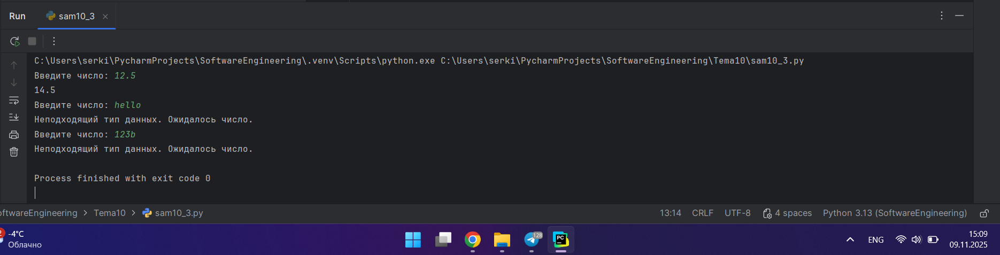

### Выводы

Если пользователь не вводит число ты мы обрабатываем эту ошибку except ValueError и выводим print("Неподходящий тип данных. Ожидалось число."). Для тестирования программы:
1. вводим число
2. вводим слово
3. вводим число с буквой
Только в 1 случае программа выполниться и выведит результат сложения.
  
## Самостоятельная работа №4
### Создайте собственный декоратор, который будет использоваться для двух любых вами придуманных функций. Декораторы, которые использовались ранее в работе нельзя воссоздавать. Результатом выполнения задачи будет: класс декоратора, две как-то связанными с ним функциями, скриншот консоли с выполненной программой и подробные комментарии, которые будут описывать работу вашего кода.

```python
class InputNumberDecorator:

    def __init__(self, func):
        self.func = func

    def __call__(self, number):
        if number > 0:
            print("Введено положительное число")
        elif number < 0:
            print("Введено отрицательное число")
        else:
            print("Введен ноль")

        result = self.func(number)

        return result


class OutputResultDecorator:

    def __init__(self, func):
        self.func = func

    def __call__(self, number):
        result = self.func(number)
        if result > 0:
            print("Результат положительный")
        elif result < 0:
            print("Результат отрицательный")
        else:
            print("Результат ноль")

        return result


@OutputResultDecorator
@InputNumberDecorator
def calculate_square(number):
    result = number ** 2
    print(f" Квадрат {number} = {result}")
    return result

@OutputResultDecorator
@InputNumberDecorator
def double_number(number):
    result = number * 2
    print(f"Удвоенное число {number}  = {result}")
    return result

@OutputResultDecorator
@InputNumberDecorator
def invert_number(number):
    result = -number
    print(f" Инвертированное число {number} = {result}")
    return result

if __name__ == '__main__':
    result1 = calculate_square(4)
    result2 = calculate_square(-3)
    result3 = double_number(5)
    result4 = double_number(-7)
    result5 = invert_number(10)
    result6 = calculate_square(0)
```
### Результат.

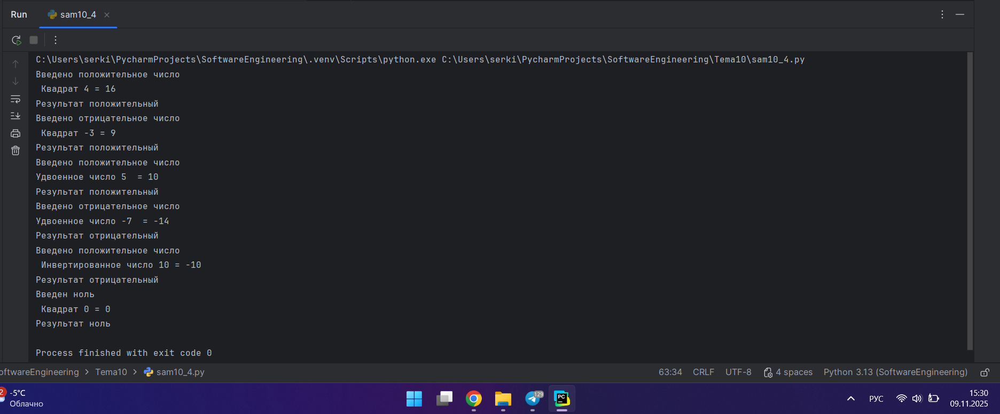

### Выводы

В данной программе мы создаем 2 декоратора:
1. первый проверяет положительное/отрицательное/ ноль полученное функциями для преобразование число;
2. второй проверяет положительное/отрицательное/ ноль результат выполнения функций;
Данные декораторы используются для функций:
1. calculate_square, которая вычисляет квадрат числа;
2. double_number, которая удваивает число;
3. invert_number, которая меняет знак числа.

## Самостоятельная работа №5
### Создайте собственное исключение, которое будет использоваться в двух любых фрагментах кода. Исключения, которые использовались ранее в работе нельзя воссоздавать. Результатом выполнения задачи будет: класс исключения, код к котором в двух местах используется это исключение, скриншот консоли с выполненной программой и подробные комментарии, которые будут описывать работу вашего кода.

```python
class NegativeNumberError(Exception):

    def __init__(self, value, message="Отрицательные числа не допускаются"):
        self.value = value
        self.message = f"{message}: {value}"
        super().__init__(self.message)

def calculate_square_root(number):
    try:
        if number < 0:
            raise NegativeNumberError(number, "Невозможно вычислить корень из отрицательного числа")
        result = number ** 0.5
        print(f"Квадратный корень из {number} = {result:.2f}")
        return result
    except NegativeNumberError as e:
        print(e)
        return None

if __name__ == '__main__':
    calculate_square_root(16)
    calculate_square_root(-9)
    calculate_square_root(0)
```

### Результат.

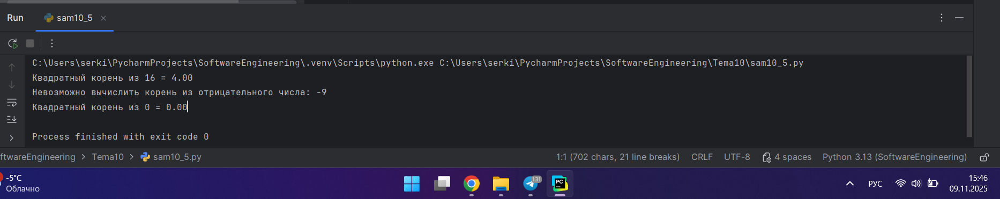

### Выводы

В коде мы создаем исключение для отрицательных чисел при вычислении корня. Если поступает отрицательное число мы обрабатываем исключение raise NegativeNumberError(number, "Невозможно вычислить корень из отрицательного числа").

## Общие выводы по теме

Итогом данной работы стало понимание принципов работы с декораторами и исключениями. 
