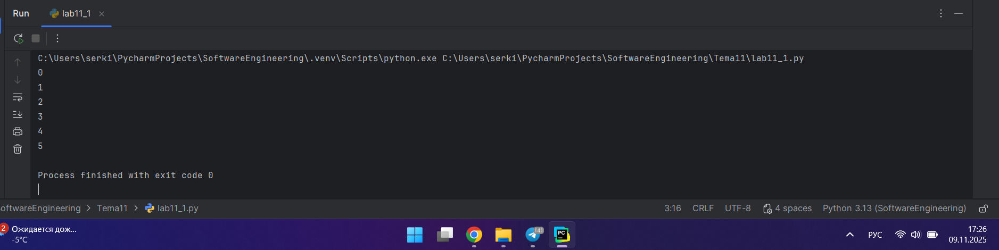
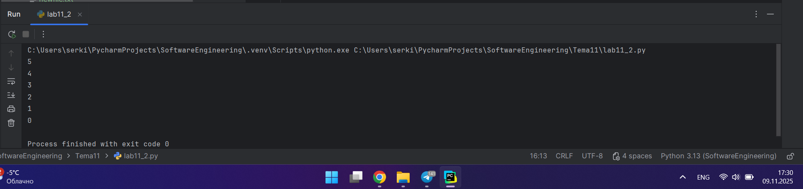
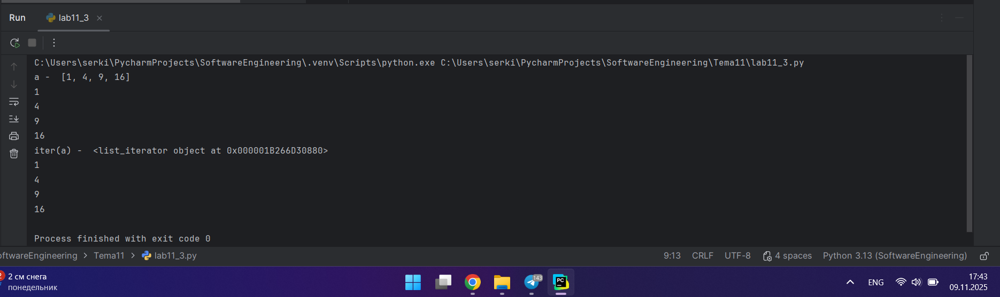
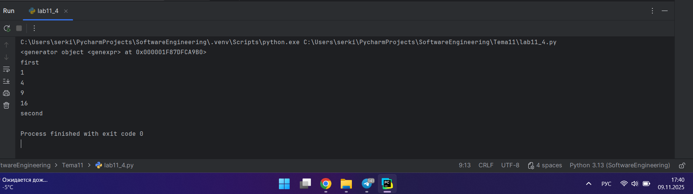
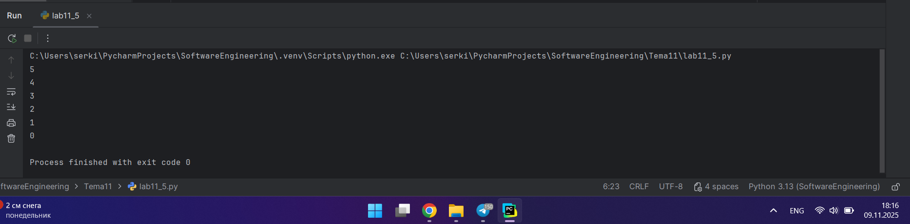
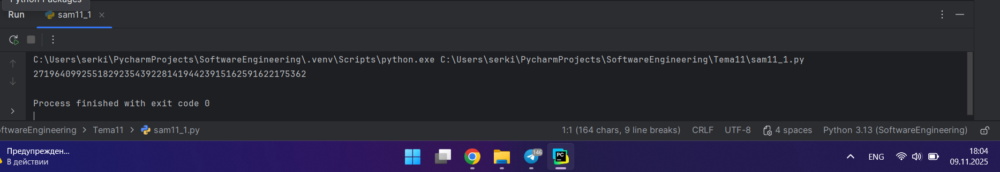
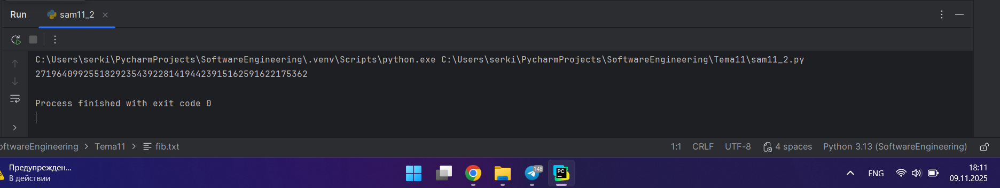
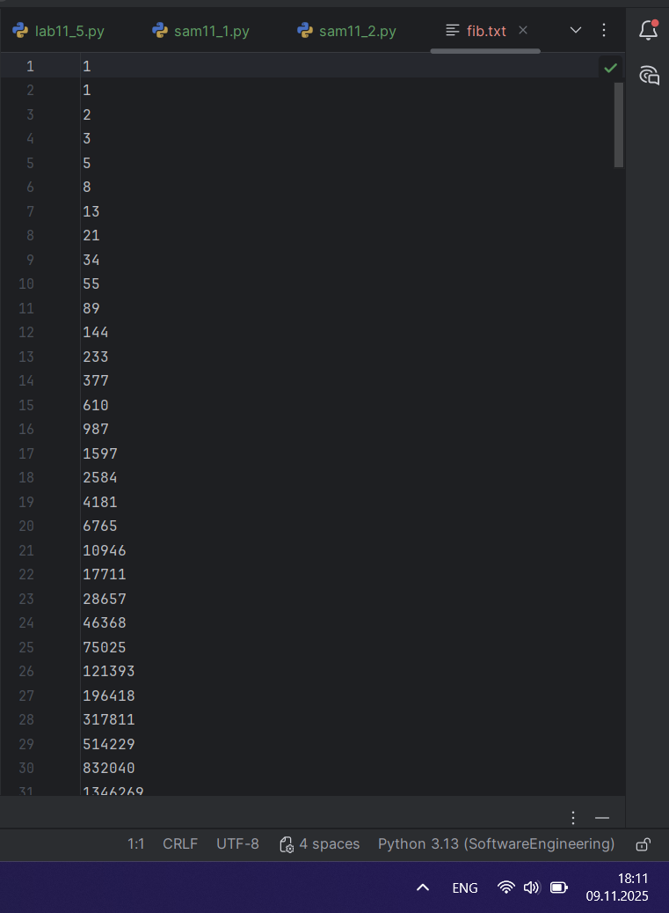

# Тема 11. Итераторы и генераторы
Отчет по Теме #11 выполнила:
- Серкина Ксения Кирилловна
- ПИЭ-23-1

| Задание | Лаб_раб | Сам_раб |
| ------ |---------|---------|
| Задание 1 | +       | +       |
| Задание 2 | +       | +       |
| Задание 3 | +       | -       |
| Задание 4 | +       | -       |
| Задание 5 | +       | -       |

знак "+" - задание выполнено; знак "-" - задание не выполнено;

Работу проверили:
- к.э.н., доцент Панов М.А.

## Лабораторная работа №1
### Простой итератор, но у него нет гибкой настройки, например его нельзя развернуть. Он работает просто как next(), но нет prev()

```python
numbers = [0, 1, 2, 3, 4, 5]
for item in numbers:
    print(item)
```
### Результат.



### Вывод

Простой итератор имеет конструкцию for...in... и вызывает функцию  iter() для объекта контейнера. Функция возвращает объект итератора, который определяет метод __next__(), который, в свою очередь обращается к элементам в контейнере по одному за раз. Когда нет больше элементов, __next__() возбуждает исключение StopIteration, которое указывает циклу о завершении.

## Лабораторная работа №2
### Класс итератор с гибкой настройкой и удобными применением

```python
class CountDown:
    def __init__(self, start):
        self.count = start + 1

    def __iter__(self):
        return self

    def __next__(self):
        self.count -= 1
        if self.count < 0:
            raise StopIteration
        return self.count

counter = CountDown(5)
for i in counter:
    print(i)
```
### Результат.



### Выводы

Для настройки итератора необходимо создать класс, в котором будет определен метод __iter__(), который возвращает объект с методом __next__(). 

## Лабораторная работа №3
### Генератор списка

```python
a = [i ** 2 for i in range(1, 5)]

print('a - ', a)
for i in a:
    print(i)

print('iter(a) - ', iter(a))
for i in a:
    print(i)
```
### Результат.



### Выводы

В данном коде мы создаем генератор и выводим его 3 разными способами:
1. просто через print;
2. чрез конструкцию for in, но теперь мы выводим попорядку;
3. испольуем метод iter(), для получения итератора из объекта.
  
## Лабораторная работа №4
### Выражения генераторы

```python
b = (i ** 2 for i in range(1, 5))
print(b)
print('first')
for i in b:
    print(i)
print('second')

for i in b:
    print(i)
```
### Результат.



### Выводы

Используем генератор и создаем массив. Затем выводим его только 1 раз, из-за особенностей работы генераторов.

## Лабораторная работа №5
### Такой же счетчик, как и в первом задании, только это генератор и использует yield

```python
def countdown(count):
    while count >= 0:
        yield count
        count -= 1

counter = countdown(5)
for i in counter:
    print(i)
```
### Результат.



### Выводы

В данном коде мы воспользовались yield, ключевым словом, которое используется для возврата из функции с сохранением состояния ее локальных переменных, и при повторном вызове такой функции выполнение продолжается с оператора yield, на котором ее работа была прервана.

## Самостоятельная работа №1
### Вас никак не могут оставить числа Фибоначчи, очень уж они вас заинтересовали. Изучив новые возможности Python вы решили реализовать программу, которая считает числа Фибоначчи при помощи итераторов. Расчет начинается с чисел 1 и 1. Создайте функцию fib(n), генерирующую n чисел Фибоначчи с минимальными затратами ресурсов. Для реализации этой функции потребуется обратиться к инструкции yield (Она не сохраняет в оперативной памяти огромную последовательность, а дает возможность “доставать” промежуточные результаты по одному). Результатом решения задачи будет листинг кода и вывод в консоль с числом Фибоначчи от 200.

```python
def fib(n):
    a, b = 1, 1
    for num in range(n):
        yield a
        a, b = b, a + b

n = 243
fibonacci_numbers = list(fib(n))

print(fibonacci_numbers[-1])
```
### Результат.



### Выводы

1. Функция fib(n) принимает одно целое число n, которое указывает, сколько чисел Фибоначчи нужно сгенерировать.
2. Внутри функции используются две переменные a и b, которые инициализируются значениями 1 и 1.
3. Цикл for выполняется n раз. На каждой итерации:
   • Используется yield, чтобы вернуть текущее значение a.
   • Затем обновляются значения a и b для следующей итерации.
4. После вызова функции fib(n), результат преобразуется в список, чтобы получить доступ к элементам по индексу.
  
## Самостоятельная работа №2
### К коду предыдущей задачи добавьте запоминание каждого числа Фибоначчи в файл “fib.txt”, при этом каждое число должно находиться на отдельной строчке. Результатом выполнения задачи будет листинг кода и скриншот получившегося файла

```python
def fib(n):
    a, b = 1, 1
    with open('fib.txt', 'w') as f:
        for _ in range(n):
            f.write(f"{a}\n")
            yield a
            a, b = b, a + b

n = 243
fibonacci_numbers = list(fib(n))

print(fibonacci_numbers[-1])
```
### Результат.




### Выводы

1. Внутри функции fib(n) добавлена конструкция with open('fib.txt', 'w') as f, которая открывает файл fib.txt для записи (если файл не существует, он будет создан).
2. Внутри цикла for добавлена строка f.write(f"{a}\n"), которая записывает текущее число Фибоначчи в файл, добавляя перевод строки после каждого числа.

## Общие выводы по теме

В данной теме были изучены основы использования итераторов и генераторов в Python и ключевого слова yield, что значительно управщвет работу с большими массивами данных и сокращает время работы программы.
