# Тема 3. Операторы, условия, циклы
Отчет по Теме #3 выполнил(а):
- Серкина Ксения Кирилловна
- ПИЭ-23-1

| Задание | Лаб_раб | Сам_раб |
| ------ | ------ | ------ |
| Задание 1 | + | + |
| Задание 2 | + | + |
| Задание 3 | + | + |
| Задание 4 | + | + |
| Задание 5 | + | + |
| Задание 6 | + | - |
| Задание 7 | + | - |
| Задание 8 | + | - |
| Задание 9 | + | - |
| Задание 10 | + | - |

знак "+" - задание выполнено; знак "-" - задание не выполнено;

Работу проверили:
- к.э.н., доцент Панов М.А.

## Лабораторная работа №1
### Создайте две переменные, значение которых будете вводить через консоль. Также составьте условие, в котором созданные ранее переменные будут сравниваться, если условие выполняется, то выведете в консоль «Выполняется», если нет, то «Не выполняется».

```python
one = int(input("Введите значение первой перменной: "))
two = int(input("Введите значение второй перменной: "))
if one >= two:
    print("Выполняется")
else:
    print("Не выполняется")
```
### Результат.
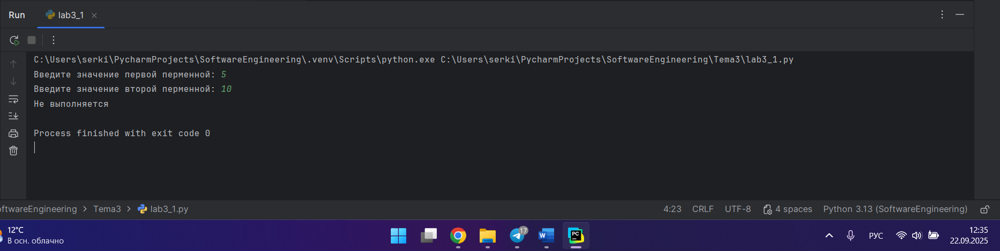

## Выводы

В задании мы вводим два числа с клавиатуры и сравниваем их.

## Лабораторная работа №2

### Напишите программу, которая будет определять значения переменной меньше 0, больше 0 и меньше 10 или больше 10. Это нужно реализовать при помощи одной переменной, значение которой будет вводится через консоль, а также при помощи конструкций if, elif, else.

```python
one = int(input("Введите значение перменной: "))
if one < 0:
    print("Переменная меньше 0")
elif 0 < one < 10:
    print("Значение переменной между 0 и 10")
else:
    print("Переменная больше 10")
```
### Результат.
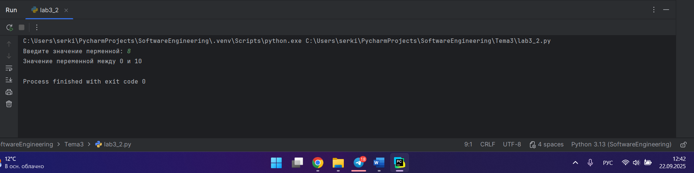

## Выводы

Используя цикл if, elif, else мы определяем в каких границах лежит цифра введёная с клавиатуры.
   
## Лабораторная работа №3

### Напишите программу, в которой будет проверяться есть ли переменная в указанном массиве используя логический оператор in. Самостоятельно посмотрите, как работает программа со значениями которых нет в массиве numbers.
```python
numbers = [1, 3, 4, 6, 8, 9]
value = int(input("Ведите значение переменной: "))
if value in numbers:
    print("Переменная есть в массиве")
else:
    print("Переменной нет в массиве")
```
### Результат.
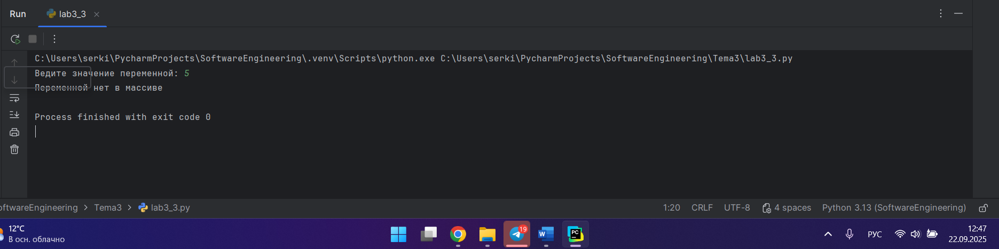

## Выводы

Используя оператор in в if, можно проверять есть ли определённый элемент в массиве.

## Лабораторная работа №4

### Напишите программу, которая будет определять находится ли переменная в указанном массиве и если да, то проверьте четная она или нет. Самостоятельно протестируйте данную программу с разными значениями переменной value.
```python
numbers = [1, 3, 4, 6, 8, 9, 15, 16, 73, 321, 322]
value = int(input("Введите значение перменной: "))
if value in numbers:
    if value % 2 == 0:
        print("Перменная чётная и есть в массиве")
    else:
        print("Переменная нечётная и есть в массиве")
else:
    print(f"Переменной нет в массиве и она равна {value}"

```
### Результат.
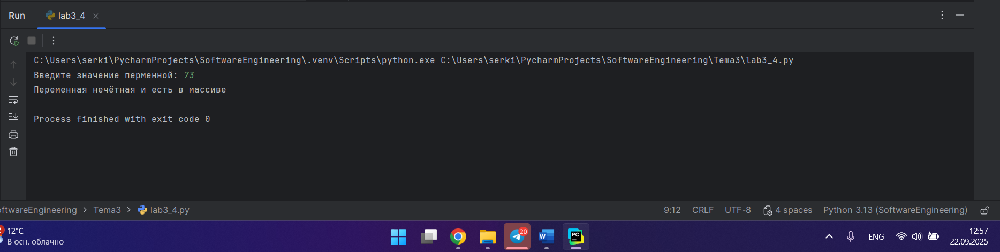

## Выводы

Мы проверяем есть ли элемент в массиве, затем ппроверяем этот элемент на чётность.

## Лабораторная работа №5

### Напишите программу, в которой циклом for значения переменной i будут меняться от 0 до 10 и посмотрите, как разные виды сравнений и операций работают в цикле.

```python
for i in range(10):
    print('i = ', i)
    if i == 0:
        i+=2
    if i == 1:
        continue
    if i == 2 or i == 3:
        print("Перменная равна 2 или 3")
    elif i in [4, 5, 6]:
        print ("Переменная равна 4, 5 или 6")
    else:
        break
```
### Результат.
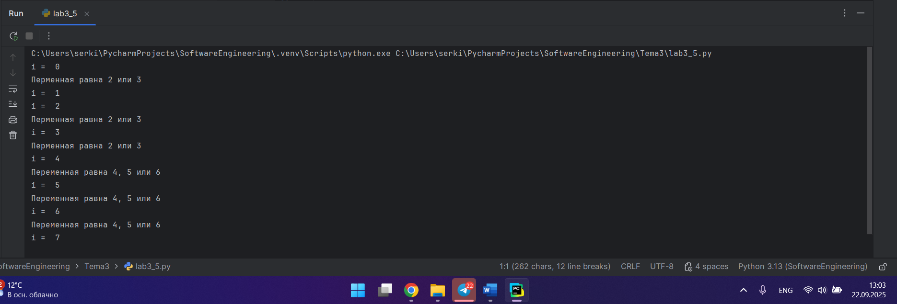

## Выводы

Цикл for позволяет изменять значение переменной в определённом диапазоне и после проверять выполнение определённых условий в if.

## Лабораторная работа №6

### Напишите программу, в которой при помощи цикла for определяется есть ли переменная value в строке string и посмотрите, как работает оператор else для циклов. Самостоятельно посмотрите, что выведет программа, если значение переменной value оказалось в строке string. Определять индекс буквы не обязательно, но если вы хотите, то это делается при помощи строки: index = string.find(value) Вы берете название переменной, в которой вы хотите что-то найти, затем применяете встроенный метод find() и в нем указываете то, что вам нужно найти. Данная строка вернет индекс искомого объекта.
```python
string = "Привет всем изучающим Pyton!"
value = input("Введите букву: ")
for i in string:
    if i == value:
        index = string.find(value)
        print(f"Буква {value} есть в строке под индексом {index}")
        break
else:
    print(f"Буквы {value} нет в строке")
```
### Результат.
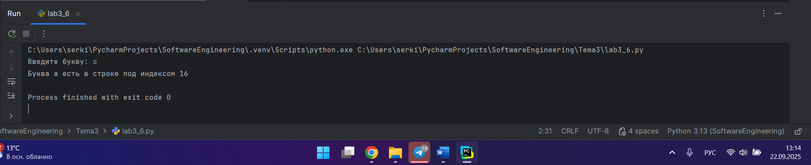

## Выводы

Используя оператор in и index = string.find(value) мы можем проверять есть ли определённый символ в строке. 

## Лабораторная работа №7

### Напишите программу, в которой вы наглядно посмотрите, как работает цикл for проходя в обратном порядке, то есть, к примеру не от 0 до 10, а от 10 до 0. В уже готовой программе показано вычитание из 100, а вам во время реализации программы будет необходимо придумать свой вариант применения обратного цикла.
```python
value = 1000
for i in range (10, -1,-1):
    value -= 50
    print (i, value)
```
### Результат.
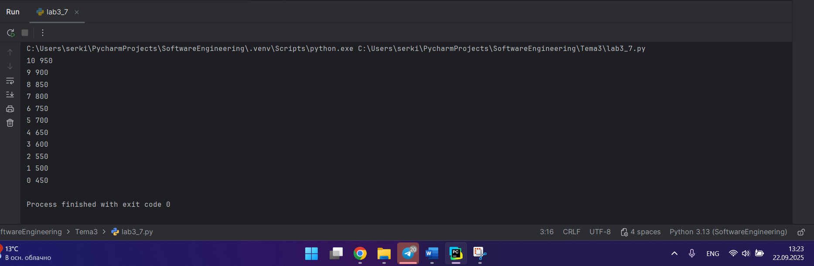

## Выводы

Для обратной итерации цикла for в условии необходимо указать шаг равный -1.

## Лабораторная работа №8

### Напишите программу используя цикл while, внутри которого есть какие-либо проверки, но быть осторожным, поскольку циклы while при неправильно написанных условиях могут становится бесконечными, как указано в примере далее.

```python
value = 0
while value < 100:
    if value == 0:
        value += 10
    elif value // 5 > 1:
        value *= 5
    else:
        value -= 5
    print(value)
```
### Результат.
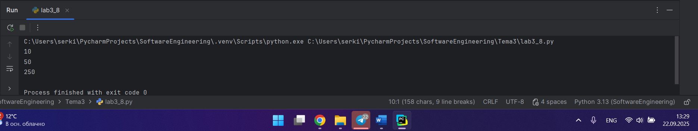

## Выводы

Цикл while можно использовать когда мы не знаем сколько иераций необходимо сделать. Для его работы нам необходимо задать условие, выполнение которого гарантирует окончание цикла.

## Лабораторная работа №9

### Напишите программу с использованием вложенных циклов и одной проверкой внутри них. Самое главное, не забудьте, что нельзя использовать одинаковые имена итерируемых переменных, когда вы используете вложенные циклы.
```python
value = 0
for i in range (10):
    for j in range (10):
        if i != j:
            value += j
        else:
            pass
print (value)
```
### Результат.
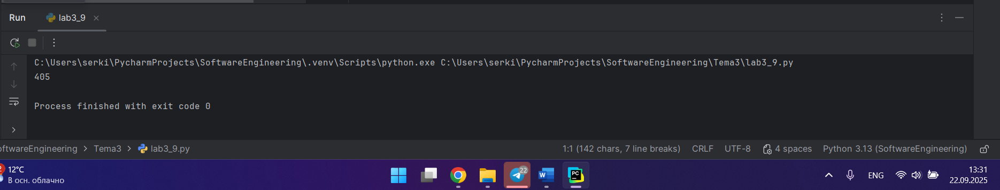

## Выводы

Pyton позволяет создавать вложенные циклы, но главное не использовать одинаковые имена итерируемых переменных.

## Лабораторная работа №10

### Напишите программу с использованием flag, которое будет определять есть ли нечетное число в массиве. В данной задаче flag выступает в роли индикатора встречи нечетного числа в исходном массиве, четных чисел.
```python
array = [2, 4, 6, 8, 9]
flag = False;
for value in array:
    if value % 2 != 0:
        flag = True
if flag:
    print("В массиве есть нечётное число")
else:
    print("В массиве все числа чётные")
```
### Результат.
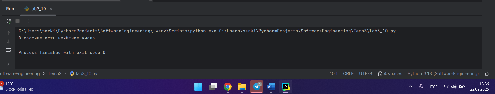

## Выводы

flag - это переменная болевого типа, которая принимает для значеня True и False. Данной переменной можно проверять отсутсвие или присутсвие чего-либо. В данной задаче flag используется, чтобы узнать есть ли в массиве нечётное число.

## Самостоятельная работа №1

### Напишите программу, которая преобразует 1 в 31. Для выполнения поставленной задачи необходимо обязательно и только один раз использовать:
### • Цикл for
### • *= 5
### • += 1 
### Никаких других действий или циклов использовать нельзя.
```python
a = 1
for i in range(2):
    a *= 5
    a += 1
print(a)
```
### Результат.
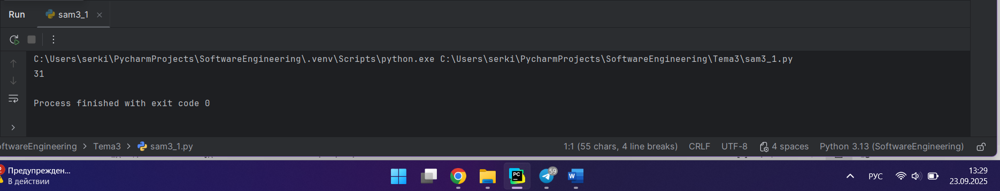

## Выводы

При взождении в цикл мы имеем число 1. В первой итерации мы получаем число 6. В второй итерации получается 31.

## Самостоятельная работа №2

### Напишите программу, которая фразу «Hello World» выводит в обратном порядке, и каждая буква находится в одной строке консоли. При этом необходимо обязательно использовать любой цикл, а также программа должна занимать не более 3 строк в редакторе кода.
```python
str  = "Hello World"
for i in reversed(str):
    print(i)
```
### Результат.
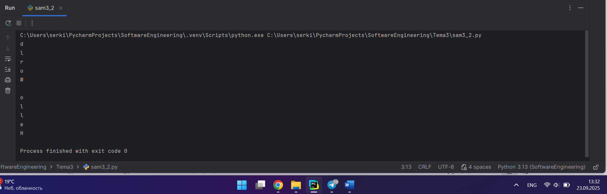

## Выводы

Для решения задачи необходимо использовать цикл for, который будет проходить по строке в обратном порядке. Для этого я использовала функцию reversed().

## Самостоятельная работа №3

### Напишите программу, на вход которой поступает значение из консоли, оно должно быть числовым и в диапазоне от 0 до 10 включительно (это необходимо учесть в программе). Если вводимое число не подходит по требованиям, то необходимо вывести оповещение об этом в консоль и остановить программу. Код должен вычислять в каком диапазоне находится полученное число. Нужно учитывать три диапазона:
### • от 0 до 3 включительно
### • от 3 до 6
### • от 6 до 10 включительно
### Результатом работы программы будет выведенный в консоль диапазон. Программа должна занимать не более 10 строчек в редакторе кода.
```python
a = int(input())
if 0 <= a <= 10:
    if a <= 3:
        print("Число в диапазоне от 0 до 3 включительно")
    elif 3 < a < 6:
        print("Число в диапазоне от 3 до 6")
    else:
        print("Число в диапазоне от 6 до 10 включительно  ")
else:
    print("Число не в ходит в диапазон от 0 до 10 включительно")
```
### Результат.
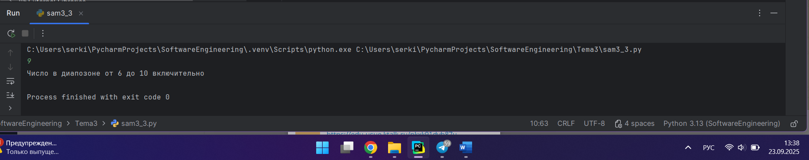

## Выводы

Для решения задачи необходимо использовать вложенные циклы: первый проверяет находится ли число в необходимом условием задачи диапазоне, второй - вычисляет в каком диапазоне находится полученное число. 

## Самостоятельная работа №4

### Манипулирование строками. Напишите программу на Python, которая принимает предложение (на английском) в качестве входных данных от пользователя. Выполните следующие операции и отобразите результаты:
### • Выведите длину предложения.
### • Переведите предложение в нижний регистр.
### • Подсчитайте количество гласных (a, e, i, o, u) в предложении.
### • Замените все слова "ugly" на "beauty".
### • Проверьте, начинается ли предложение с "The" и заканчивается ли на "end".
### Проверьте работу программы минимум на 3 предложениях, чтобы охватить проверку всех поставленных условий.
```python
str = str(input("Ведите предложение на английском: "))
print("Длина предложения",len(str))
b = str.lower()
print("В нижнем регистре", b)
count = 0;
c = "aeiou"
for i in str:
    if i in c:
        count += 1
print(count)
print(str.replace("ugly", "beauty"))
print(str.startswith("The"))
print(str.endswith("end"))
```
### Результат.
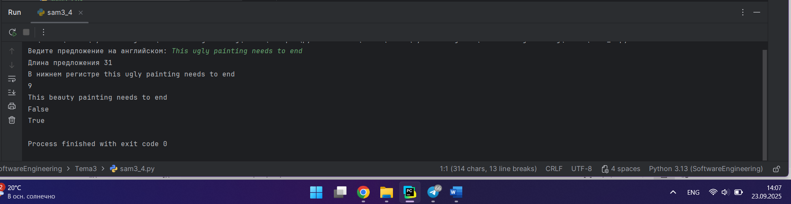

## Выводы

В данной программе использовалось:
1. `print(len(str))`: выводим длину строки;
2. `b = str.lower()`: приводим строку к нижнему регистру;
3. `print(str.replace("ugly", "beauty"))`: заменяем слово;
4. `print(str.startswith("The"))`: проверяем начинается ли предложение с "The"; 
5. `print(str.endswith("end"))`: проверяем заканчивается ли на "end".

## Самостоятельная работа №5

### Составьте программу, результатом которой будет данный вывод в консоль. Программу нужно составить из данных фрагментов кода. Строки кода можно использовать только один раз. Не обязательно использовать все строки кода.
```python
string = "hello"
memory = " world"
counter = 0
while counter != 10:
    print(string + memory)
    print(string)
    counter += 1
string = string + " world"
memory = string
print(memory)
```
### Результат.
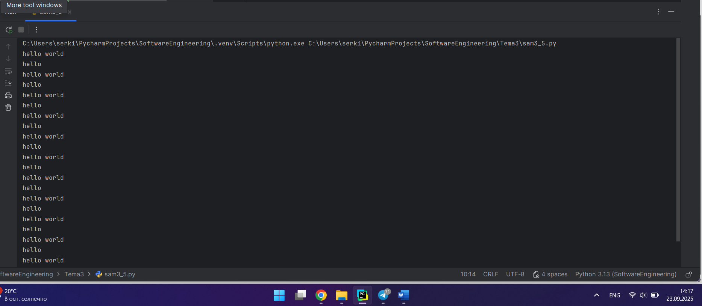

## Выводы

В задании была составлена программа, которая выводит hello world и слово hello 10 раз и в конце ещё раз.

## Общие выводы по теме

В данной работе использовались некоторые виды циклов, конструкций и операторов. В резельтате были освоены задачи в которых были использованы циклы, конструкции и операторы такие как: if, elif, else, цикл for и while. 
