# Тема 4. Функции и стандартные модули/библиотеки
Отчет по Теме #4 выполнил(а):
- Серкина Ксения Кирилловна
- ПИЭ-23-1

| Задание | Лаб_раб | Сам_раб |
| ------ | ------ | ------ |
| Задание 1 | + | + |
| Задание 2 | + | + |
| Задание 3 | + | + |
| Задание 4 | + | + |
| Задание 5 | + | + |
| Задание 6 | + | - |
| Задание 7 | + | - |
| Задание 8 | + | - |
| Задание 9 | + | - |
| Задание 10 | + | - |

знак "+" - задание выполнено; знак "-" - задание не выполнено;

Работу проверили:
- к.э.н., доцент Панов М.А.

## Лабораторная работа №1
### Напишите функцию, которая выполняет любые арифметические действия и выводит результат в консоль. Вызовите функцию используя “точку входа”.

```python
def main():
    print(2 + 2)

if __name__ == '__main__':
    main()
```
### Результат.
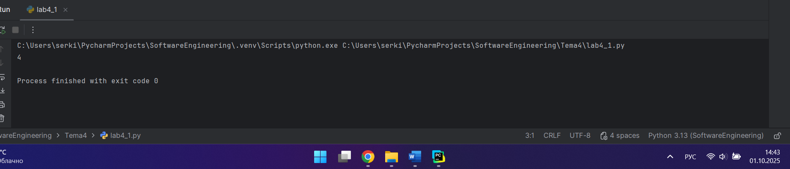

## Выводы

Используем функцию и точку входа для функции `if __name__ == '__main__':`.

## Лабораторная работа №2

### Напишите функцию, которая выполняет любые арифметические действия, возвращает при помощи return значение в место, откуда вызывали функцию. Выведите результат в консоль. Вызовите функцию используя “точку входа”. Ниже представлена точно такая же программа, как и выше, только написана более развернуто. В это программе стоит заметить что результат работы функции main() мы помещаем в переменную “answer”, в дальнейшем можно как-то работать с ним, не вызывая функцию повторно, что хорошо сказывается, например, на скорости работы программы.

```python
def main():
    result = 2 + 2
    return result
if __name__ == '__main__':
    answer = main()
    print(answer)
```
### Результат.
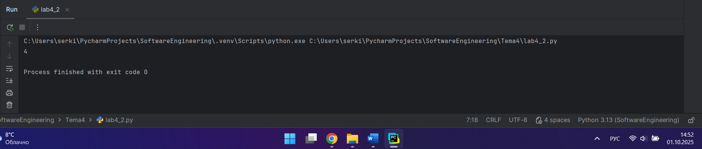

## Выводы

В отличие от предыдущего задания мы используем return, что позволяет нам получить значение из функции, при её вызове.
   
## Лабораторная работа №3

### Напишите функцию, в которую передаются два аргумента, над ними производится арифметическое действие, результат возвращается туда, откуда эту функцию вызывали. Выведите результат в консоль. Вызовите функцию в любом небольшом цикле. На скриншоте ниже приведен пример программы, в которой аргумент функции “x“превращается в параметр “one”, то же самое происходит с “y” и “two” Ниже представлена точно такая же программа, как и выше, только аргументы передаются в вызове функции, а не как отдельные переменные.
```python
def main(one, two):
    result = one + two
    return result
for i in range(5):
    x = 1
    y = 10
    answer = main(x, y)
    print(answer)
```
### Результат.
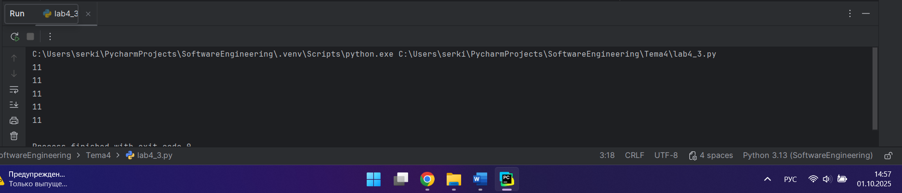

## Выводы

В данном случае для суммирования двух значений необходимо использовать функцию от 2 пременных.

## Лабораторная работа №4

### Напишите функцию, на вход которой подается какое-то изначальное неизвестное количество аргументов, над которыми будет производится арифметические действия. Для выполнения задания необходимо использовать кортеж “*args”. На скриншоте ниже приведен пример такой программы с комментариями. Для закрепления понимания работы с кортежами настоятельно рекомендуем поменять аргументы вызова функции, вручную посчитать результат, только потом запустить программу с новыми значениями и проверить себя, насколько вы поняли данный аспект программирования.
```python
def main(x, *args):
    one = x
    two = sum(args)
    three = float(len(args))
    print(f"one={one}\ntwo={two}\nthree={three}")
    return x + sum(args) / float(len(args))
if __name__ == '__main__':
    result = main(10, 0, 1, 2, -1, 0, -1, 1, 2)
    print(f"\nresult={result}")
```
### Результат.
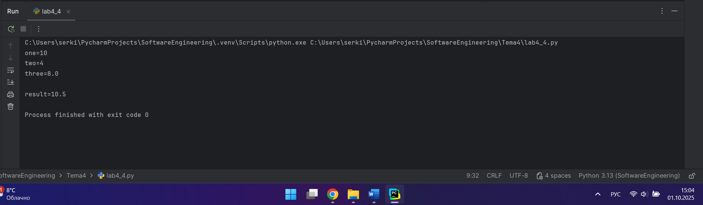

## Выводы

Для входа функции от двух переменных можно использовать как аргумент кортеж.

## Лабораторная работа №5

### Напишите функцию, которая на вход получает кортеж “**kwargs” и при помощи цикла выводит значения, поступившие в функцию. На скриншоте ниже указаны два варианта вызова функции с “**kwargs” и два варианта работы с данными, поступившими в эту функцию. Комментарии в коде и теоретическая часть помогут вам разобраться в этом нелегком аспекте. Вызовите функцию используя “точку входа”.
```python
def main(**kwargs):
    for i in kwargs.items():
        print(i[0], i[1])
    print()
    for key in kwargs:
        print(f"{key} = {kwargs[key]}")
if __name__ == '__main__':
    main(x=[1, 2, 3], y=[3, 3, 0], z=[2, 3, 0], q=[3, 3, 0], w=[3, 3, 0])
    print()
    main(**{'x': [1, 2, 3], 'y': [3, 3, 0]})
```
### Результат.
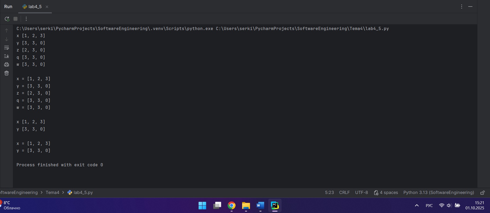

## Выводы

Мы используем два цикла для разного вывода в консоль. В первом цикле,для вывода мы обращаемся по ключу i[0]  и значению i[1]. В втором цикле мы перебираем только по ключам в словаре. Функцию мы вызываем двумя способами эквивалентными друг-другу.

## Лабораторная работа №6

### Напишите две функции. Первая – получает в виде параметра “**kwargs”. Вторая считает среднее арифметическое из значений первой функции. Вызовите первую функцию используя “точку входа” и минимум 4 аргумента.
```python
def main(**kwargs):
    for i, j in kwargs.items():
        print(f"{i}. Mean = {mean(j)}")

def mean(data):
    return sum(data) / float(len(data))

if __name__ == '__main__':
    main(x=[1, 2, 3], y=[3, 3, 0])
```
### Результат.
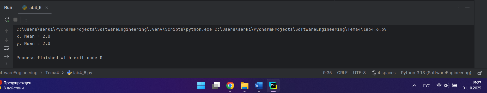

## Выводы

'def mean(data):' считает среднее арифмитическое и передает его в функцию main. Функция main выводит результат подсчёта.

## Лабораторная работа №7

### Создайте дополнительный файл .py. Напишите в нем любую функцию, которая будет что угодно выводить в консоль, но не вызывайте ее в нем. Откройте файл main.py, импортируйте в него функцию из нового файла и при помощи “точки входа” вызовите эту функцию.
```python
def say_hello():
    print('Hello students')
```
```python
from lab4_7_1 import say_hello
if __name__ == '__main__':
    say_hello()
```
### Результат.
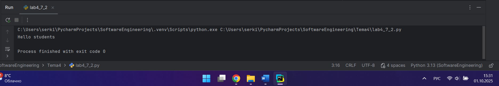

## Выводы

Для использования функции из другого файла, необходимо импортировать функцию и вызвать её.

## Лабораторная работа №8

### Напишите программу, которая будет выводить корень, синус, косинус полученного от пользователя числа. На первом скриншоте мы просто импортировали модуль math целиком и вызвали его длинным способом через math.название_фунции. Также импорт стандартного модуля в python возможно осуществить и другими способами, которые будут выполнять ту же самую функцию, но синтаксис будет немного отличатся. На втором скриншоте из модуля math мы загрузили в программу только 3 необходимые функции и обращались к ним так, будто они находятся у нас в файле просто через их название. Также замечу что мы импортировали три функции в одну строку, что очень удобно. На третьем скриншоте мы импортировали модуль math и при помощи оператора * загрузили все его функции. По большому счеты мы сделали то же самое что и на первом скриншоте, но у нас только поменялся синтаксис вызова этих функций, он стал похож на вызов со второго скриншота.

```python
from math import *

def main():
    value = int(input('Введите значение: '))
    print(sqrt(value))
    print(sin(value))
    print(cos(value))

if __name__ == '__main__':
    main()
```
### Результат.


## Выводы

Для меня наиболее удобен споосб импортировать модуль через оператор * , так как он сокращает код и позволяет не указывать модуль при использовании функций этого модуля.

## Лабораторная работа №9

### Напишите программу, которая будет рассчитывать какой день недели будет через n-нное количество дней, которые укажет пользователь. В результате день недели указан в виде цифры, где 1 = понедельник, 2 = вторник, 3 = среда и так далее.
```python
from datetime import datetime as dt
from datetime import timedelta as td

def main():
    print(
        f"Сегодня {dt.today().date()}. "
        f"День недели - {dt.today().isoweekday()}"
    )
    n = int(input('Введите количество дней: '))
    today = dt.today()
    result = today + td(days=n)
    print(
        f"Через {n} дней будет {result.date()}. "
        f"День недели - {result.isoweekday()}"
    )

if __name__ == '__main__':
    main()
```
### Результат.
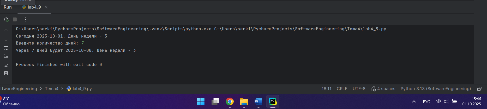

## Выводы

Для вывода даты мы импортируем билиотеку datatime и даем псевдонимы для сокращения кода.

## Лабораторная работа №10

### Напишите программу с использованием глобальных переменных, которая будет считать площадь треугольника или прямоугольника в зависимости от того, что выберет пользователь. Получение всей необходимой информации реализовать через input(), а подсчет площадей выполнить при помощи функций. Результатом программы будет число, равное площади, необходимой фигуры.
```python
global result
def rectangle():
    a = float(input("Ширина: "))
    b = float(input("Высота: "))
    global result
    result = a * b
def triangle():
    a = float(input("Основание: "))
    h = float(input("Высота: "))
    global result
    result = 0.5 * a * h
figure = input("1-прямоугольник, 2-треугольник: ")
if figure == '1':
    rectangle()
elif figure == '2':
    triangle()
print(f"Площадь: {result}")
```
### Результат.
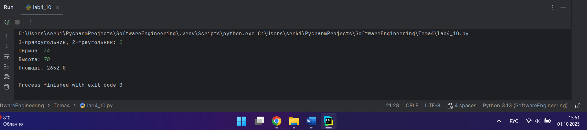

## Выводы

в завсимости от выбора пользователя мы вызываем одну из функций, которая запрашивает необходимы для задачи парметры и считает площадь.

## Самостоятельная работа №1

### Дайте подробный комментарий для кода, написанного ниже. Комментарий нужен для каждой строчки кода, нужно описать что она делает. Не забудь те, что функции комментируются по-особенному.
```python
from datetime import datetime  # Импорт класса для работы со временем
from math import sqrt  # Импорт функции для вычисления квадратного корня

def main(**kwargs):
    """
    Вычисляет евклидову норму для векторов, переданных в параметрах.
    Аргументы:
        **kwargs (dict): Словарь с произвольными именованными параметрами,
        где значения - списки из двух чисел [x, y]
    Возращаемое значение:
        Для каждого переданного вектора вычисляется sqrt(x² + y²)
    """
    for key in kwargs.items():  # Итерация по парам
        result = sqrt(key[1][0] ** 2 + key[1][1] ** 2)  # Вычисление евклидовой нормы вектора
        print(result)  # Вывод результата вычисления

if __name__ == '__main__':
    start_time = datetime.now()  # Запись времени начала выполнения программы

    main(
        one=[10, 3],  # Примеры векторов для вычисления
        two=[5, 4],
        three=[15, 13],
        four=[93, 53],
        five=[133, 15]
    )

    time_costs = datetime.now() - start_time  # Расчет времени выполнения
    print(f"Время выполнения программы - {time_costs}")  # Вывод времени выполнения
```
### Результат.
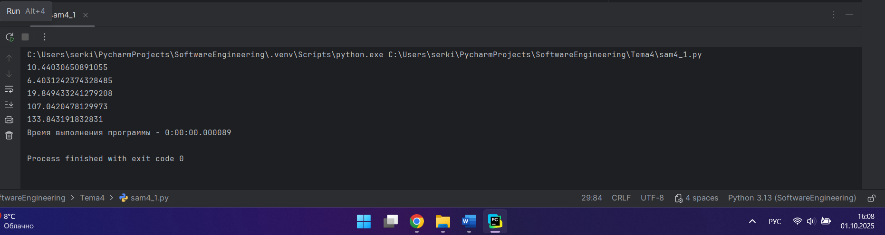

## Выводы

Для правильного комментрирования функции есть соглашение с помощью строки документации.

## Самостоятельная работа №2

###  Напишите программу, которая будет заменять игральную кость с 6 гранями. Если значение равно 5 или 6, то в консоль выводится «Вы победили», если значения 3 или 4, то вы рекурсивно должны вызвать эту же функцию, если значение 1 или 2, то в консоль выводится «Вы проиграли». При этом каждый вызов функции необходимо выводить в консоль значение “кубика”. Для выполнения задания необходимо использовать стандартную библиотеку random. Программу нужно написать, используя одну функцию и “точку входа”
```python
from random import randint

def throw():
    number = randint(1, 6)
    print(f"Значение кубика: {number}")
    if number == 5 or number == 6:
        print("Вы победили")
    elif number == 3 or number == 4:
        throw()
    elif number == 1 or number == 2:
        print("Вы проиграли")

if __name__ == '__main__':
    throw()
```
### Результат.
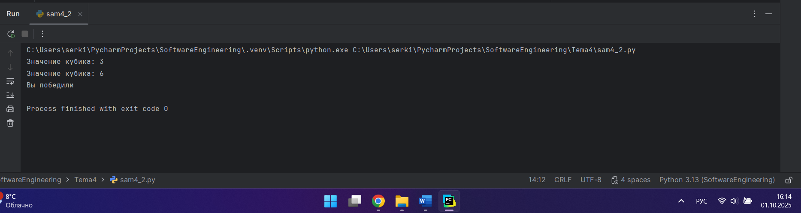

## Выводы

Для вывода рандомного числа была использована функция randint, котрая генерирует целое число в перделах определённого заданного программой диапозона, в нашем случае от 1 до 6. В заваисмости от того какое число выпало мы совершаем действия.

## Самостоятельная работа №3

### Напишите программу, которая будет выводить текущее время, с точностью до секунд на протяжении 5 секунд. Программу нужно написать с использованием цикла. Подсказка: необходимо использовать модуль datetime и time, а также вам необходимо как-то “усыплять” программу на 1 секунду.

```python
import time
from datetime import datetime

sec = 5
for i in range(sec):
    current_time = datetime.now()
    print("Текущее время:", current_time)
    time.sleep(1)
```
### Результат.
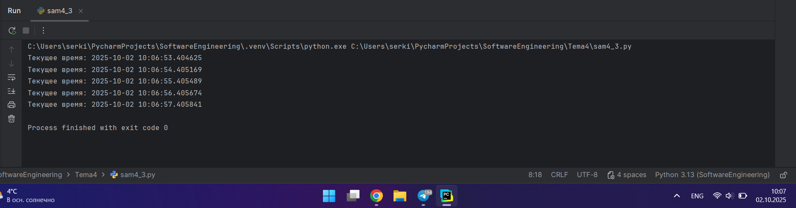

## Выводы

Для вывода вермени необходимо подключить библиотеку datetime и создать цикл, который будет выводить время 5 раз. Для того чтобы усыплять программу на 1 секунду, можно использовать time.sleep(1).

## Самостоятельная работа №4

### Напишите программу, которая считает среднее арифметическое от аргументов вызываемое функции, с условием того, что изначальное количество этих аргументов неизвестно. Программу необходимо реализовать используя одну функцию и “точку входа”.
```python
def main(*args):
    return sum(args) / len(args)

if __name__ == '__main__':
    print(main(1, 2, 3, 4, 5, 6))
    print(main(10, 3, -5, 8))
```
### Результат.
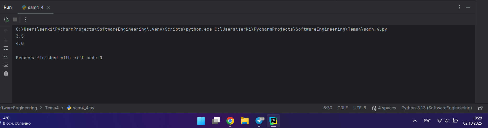

## Выводы

На вход функции поступает кортеж и это никак не вляет на работоспособность функции и количество аргументов.

## Самостоятельная работа №5

### Создайте два Python файла, в одном будет выполняться вычисление площади треугольника при помощи формулы Герона (необходимо реализовать через функцию), а во втором будет происходить взаимодействие с пользователем (получение всей необходимой информации и вывод результатов). Напишите эту программу и выведите в консоль полученную площадь.
```python
from sam4_5_2 import square

if __name__ == '__main__':
    a = int(input("Введите a: "))
    b = int(input("Введите b: "))
    c = int(input("Введите c: "))
    print(square(a, b, c))
```
```python
from math import sqrt

def square(a, b, c):
    p = (a + b + c) / 2
    return sqrt(p * (p - a) * (p - b) * (p - c))
```
### Результат.
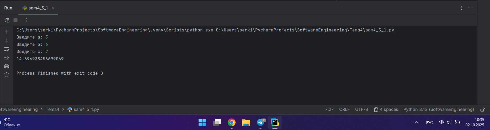

## Выводы

В первом файле мы импортируем функцию square, получаем пользовательский ввод и вызывем функцию из второго файла. В функцию поступают 3 аргумента, которые были введены пользователем и считается площадь по формуле Герона.

## Общие выводы по теме

По итогам данной теме было освоено подключение различных библиотек и функций из них, получен практический опыт создания своих функций и вывзов из из других файлов и через точку входа.
