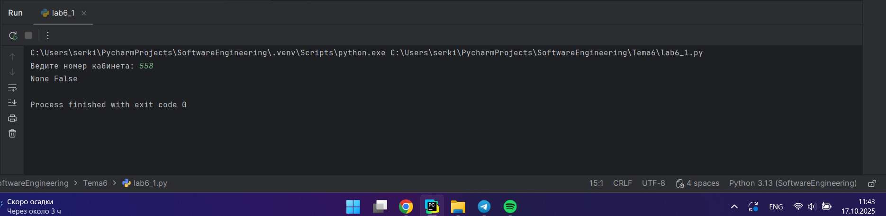
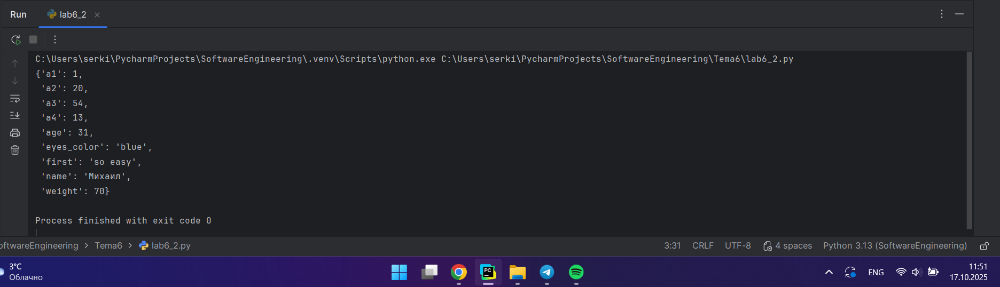
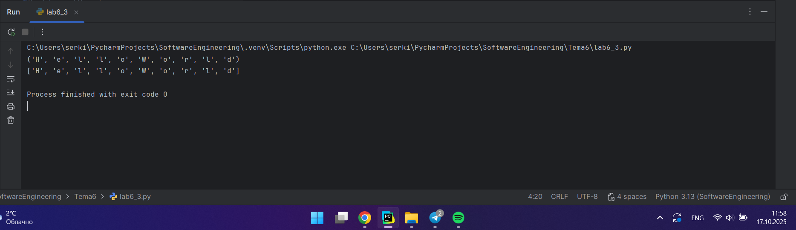
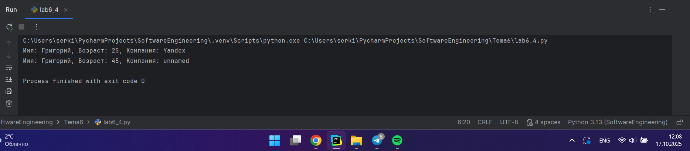
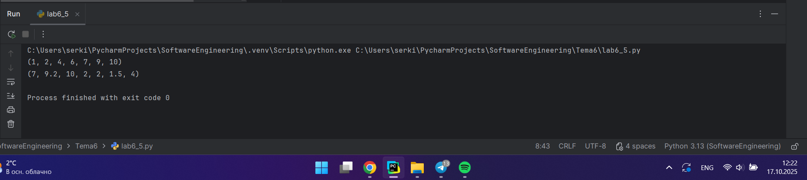
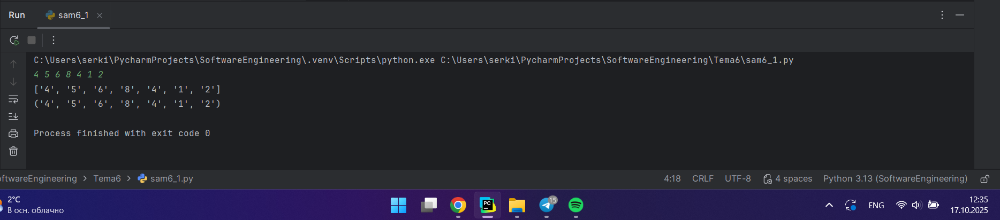
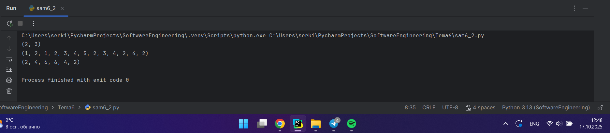
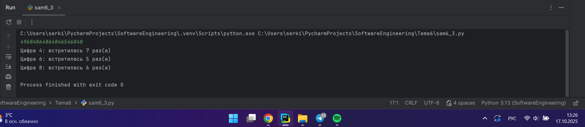
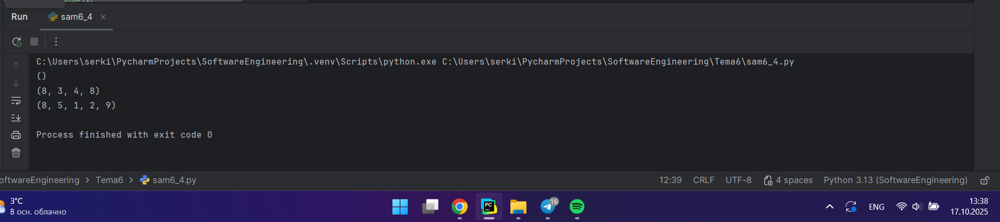
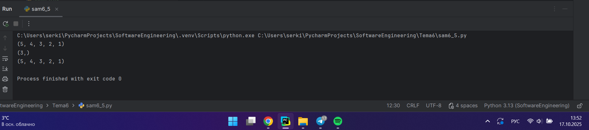

# Тема 6. Базовые коллекции: словари, кортежи
Отчет по Теме #6 выполнил:
- Серкина Ксения Кирилловна
- ПИЭ-23-1

| Задание | Лаб_раб | Сам_раб |
| ------ |---------|---------|
| Задание 1 | +       | +       |
| Задание 2 | +       | +       |
| Задание 3 | +       | +       |
| Задание 4 | +       | +       |
| Задание 5 | +       | +       |

знак "+" - задание выполнено; знак "-" - задание не выполнено;

Работу проверили:
- к.э.н., доцент Панов М.А.

## Лабораторная работа №1
### В школе, где вы учились, узнали, что вы крутой программист и попросили написать программу для учителей, которая будет при вводе кабинета писать для него ключ доступа и статус, занят кабинет или нет. При написании программы необходимо использовать словарь (dict), который на вход получает номер кабинета, а выводит необходимую информацию. Если кабинета, который вы ввели нет в словаре, то в консоль в виде значения ключа нужно вывести “None” и виде статуса вывести “False”. По большому счету написав данную программу мы с вами научились заменять иногда громоздкую конструкцию if/elif/else. Поскольку здесь функционал словаря полностью повторяет функционал условия, но при этом у использования словарей в более сложных программах есть намного больше возможностей реализации.

```python
request = int(input('Ведите номер кабинета: '))
dictionary = {
    101: {'key': 1234, 'access': True},
    102: {'key': 1337, 'access': True},
    103: {'key': 8943, 'access': True},
    104: {'key': 5555, 'access': False},
    None: {'key': None, 'access': False},
}
response = dictionary.get(request)
if not response:
    response = dictionary[None]
key = response.get('key')
access = response.get('access')
print(key, access)

```
### Результат.



### Выводы

В программе создается словарь с значениями и мы получаем информацию из него, используя функцию get. 

## Лабораторная работа №2
### Алексей решил создать самый большой словарь в мире. Для этого он придумал функцию dict_maker (**kwargs), которая принимает неограниченное количество параметров «ключ: значение» и обновляет созданный им словарь my_dict, состоящий всего из одного элемента «first» со значением «so easy». Помогите Алексею создать данную функцию. Ниже на скриншоте мы использовали встроенный модуль pprint, который выводит большие объемы информации более понятно для восприятия человеческим глазом. Иногда очень удобно использовать данную возможность Python.

```python
from pprint import pprint

my_dict = {'first': 'so easy'}
def dict_maker(**kwargs):
    my_dict.update(**kwargs)
dict_maker(a1=1, a2=20, a3=54, a4=13)
dict_maker(name='Михаил', age=31, weight=70, eyes_color='blue')
pprint(my_dict)
```
### Результат.



### Выводы

Используя функцию и update мы можем добавлять значения в словарь, при этом значения до первого использования update  перезаписываются.

## Лабораторная работа №3
### Для решения некоторых задач бывает необходимо разложить строку на отдельные символы. Мы знаем что это можно сделать при помощи split(), у которого более гибкая настройка для разделения для этого, но если нам нужно посимвольно разделить строку без всяких условий, то для этого мы можем использовать кортежи (tuple). Для этого напишем любую строку, которую будем делить и “обвернем” ее в tuple и дальше мы можем как нам угодно с ней работать, например, сделать ее списком (тогда получится полный аналог split()) или же работать с ним дальше, как с кортежем.

```python
input_str = 'HelloWorld'
result = tuple(input_str)
print(result)
print(list(result))
```
### Результат.



### Выводы

Альтернативным способ разделить строку на символы является использование кортежа т.к после создания кортежа его элементы нельзя изменить, удалить или добавить, что делает его полезным для защиты данных.
  
## Лабораторная работа №4
### Вовочка решил написать крутую функцию, которая будет писать имя, возраст и место работы, но при этом на вход этой функции будет поступать кортеж. Помогите Вовочке написать эту программу.

```python
def personal_info(name, age, company = 'unnamed'):
    print(f'Имя: {name}, Возраст: {age}, Компания: {company}')
one = ('Григорий',25,'Yandex')
two = ('Григорий',45)
personal_info(*one)
personal_info(*two)
```
### Результат.



### Выводы

На вход функции может поступать кортеж и его можно обрабатывать в ней.

## Лабораторная работа №5
### Для сопровождения первых лиц государства X нужен кортеж, но никто не может определиться с порядком машин, поэтому вам нужно написать функцию, которая будет сортировать кортеж, состоящий из целых чисел по возрастанию, и возвращает его. Если хотя бы один элемент не является целым числом, то функция возвращает исходный кортеж.

```python
def tuple_sort(trp):
    for elm in trp:
        if not isinstance(elm, int):
            return trp
    return tuple(sorted(trp))
if __name__ == '__main__':
    print(tuple_sort((7,9,10,2,6,1,4)))
    print(tuple_sort((7,9.2,10,2,2,1.5,4)))
```
### Результат.



### Выводы

Для проверки дробных чискл в кортеже используется функция isinstance(), которая проверяет является ли объект экземпляром класса или кортежа классов.

## Самостоятельная работа №1
### При создании сайта у вас возникла потребность обрабатывать данные пользователя в странной форме, а потом переводить их в нужные вам форматы. Вы хотите принимать от пользователя последовательность чисел, разделенных пробелом, а после переформатировать эти данные в список и кортеж. Реализуйте вашу задумку. Для получения начальных данных используйте input(). Результатом программы будет выведенный список и кортеж из начальных данных.

```python
str = input()
res = str.split()
print (res)
print(tuple(res))
```
### Результат.



### Выводы

 1. Мы получаем пользовательский ввод,
 2. разделяем строку по любым символами с помощью split(),
 3. выводим строку и преобразовываем её в кортеж и также выводим.
  
## Самостоятельная работа №2
### Николай знает, что кортежи являются неизменяемыми, но он очень упрямый и всегда хочет доказать, что он прав. Студент решил создать функцию, которая будет удалять первое появление определенного элемента из кортежа по значению и возвращать кортеж без него. Попробуйте повторить шедевр не признающего авторитеты начинающего программиста. Но учтите, что Николай не всегда уверен в наличии элемента в кортеже (в этом случае кортеж вернется функцией в исходном виде).
### Входные данные:
### (1, 2, 3), 1)
### (1, 2, 3, 1, 2, 3, 4, 5, 2, 3, 4, 2, 4, 2), 3) 
### (2, 4, 6, 6, 4, 2), 9)
### Ожидаемый результат:
### (2, 3)
### (1, 2, 1, 2, 3, 4, 5, 2, 3, 4, 2, 4, 2)
### (2, 4, 6, 6, 4, 2)

```python
def remove_elem(trp,elem):
    tuple_list = list(trp)
    if elem in tuple_list:
        tuple_list.remove(elem)
    return tuple(tuple_list)
print(remove_elem((1, 2, 3), 1))
print(remove_elem((1, 2, 3, 1, 2, 3, 4, 5, 2, 3, 4, 2, 4, 2), 3))
print(remove_elem((2, 4, 6, 6, 4, 2), 9))
```
### Результат.



### Выводы

Для того чтобы преобразовывать кортеж мы преобразуем его в список и производим модификацию. Затем обратно преобразовываем в кортеж.
  
## Самостоятельная работа №3
### Ребята поспорили кто из них одним нажатием на numpad наберет больше повторяющихся цифр, но не понимают, как узнать победителя. Вам им нужно в этом помочь. Дана строка в виде случайной последовательности чисел от 0 до 9 (длина строки минимум 15 символов). Требуется создать словарь, который в качестве ключей будет принимать данные числа (т. е. ключи будут типом int), а в качестве значений – количество этих чисел в имеющейся последовательности. Для построения словаря создайте функцию, принимающую строку из цифр. Функция должна возвратить словарь из 3-х самых часто встречаемых чисел, также эти значения нужно вывести в порядке возрастания ключа.

```python
def count_digit(input_str):
    frequency = {}
    for char in input_str:
        digit = int(char)
        if digit in frequency:
            frequency[digit] += 1
        else:
            frequency[digit] = 1
    sorted_items = sorted(frequency.items(), key=lambda x: x[1], reverse=True)
    res = dict(sorted_items[:3])
    keys = sorted(res.keys())
    for digit in sorted(res.keys()): 
        count = res[digit]
        print(f"Цифра {digit}: встретилась {count} раз(а)")
    return res
count_digit(str(input()))
```
### Результат.



### Выводы

Функция получает на вход строку затем разбивается по символам и добавляется в словарь. Если она уже есть в словаре увеличивается количество. После добавления всех символов, мы сортируем словарь и выводим результат.
  
## Самостоятельная работа №4
### Ваш хороший друг владеет офисом со входом по электронным картам, ему нужно чтобы вы написали программу, которая показывала в каком порядке сотрудники входили и выходили из офиса. Определение сотрудника происходит по id. Напишите функцию, которая на вход принимает кортеж и случайный элемент (id), его можно придумать самостоятельно. Требуется вернуть новый кортеж, начинающийся с первого появления элемента в нем и заканчивающийся вторым его появлением включительно. Если элемента нет вовсе – вернуть пустой кортеж. Если элемент встречается только один раз, то вернуть кортеж, который начинается с него и идет до конца исходного.
### Входные данные:
### (1, 2, 3), 8)
### (1, 8, 3, 4, 8, 8, 9, 2), 8)
### (1, 2, 8, 5, 1, 2, 9), 8)
### Ожидаемый результат:
### ()
### (8, 3, 4, 8)
### (8, 5, 1, 2, 9)

```python
def extract_subtuple(tup, element):
    if element not in tup:
        return ()
    first_index = tup.index(element)
    try:
        second_index = tup.index(element, first_index + 1)
        return tup[first_index:second_index + 1]
    except ValueError:
        return tup[first_index:]
print(extract_subtuple((1, 2, 3), 8))
print(extract_subtuple((1, 8, 3, 4, 8, 8, 9, 2), 8))
print(extract_subtuple((1, 2, 8, 5, 1, 2, 9), 8))
```
### Результат.



### Выводы

1. `if element not in tup:` проверяем, есть ли элемент в кортеже
2. `first_index = tup.index(element)` находим первое появление элемента
3. `second_index = tup.index(element, first_index + 1)` ищем второе появление элемента после первого
4. `return tup[first_index:second_index + 1]` возвращаем кортеж от первого до второго появления элемента
5. `return tup[first_index:]` если второго появления нет, возвращаем кортеж от первого появления до конца
  
## Самостоятельная работа №5
### Самостоятельно придумайте и решите задачу, в которой будут обязательно использоваться кортеж или список. Проведите минимум три теста для проверки работоспособности вашей задачи.
### Перед студентом стоит задача: на вход функции sieve() поступает список целых чисел. В результате выполнения этой функции будет получен кортеж уникальных элементов списка в обратном порядке.

```python
def sieve(numbers):
    unique_list = []
    for num in numbers:
        if num not in unique_list:
            unique_list.append(num)
    unique_list.reverse()
    result = tuple(unique_list)
    return result

print(sieve([1, 2, 3, 2, 1, 4, 5]))
print(sieve([3, 3, 3, 3]))
print(sieve([1, 2, 3, 4, 5]))
```

### Результат.



### Выводы

Создаем функцию, котороя выводит только кортеж из уникальных значений в обратном порядке. Для этого мы создаем список в который добавляем всё уникакльные элементы, затем разворачиваем и преобразуем в кортеж.

## Общие выводы по теме

В данной теме я познакомилась с работой с словарями, дополнила знания о кортежах и списках. Изучила новые способы использовать функции.
