# Тема 7. Работа с файлами (ввод и вывод)
Отчет по Теме #7 выполнила:
- Серкина Ксения Кирилловна
- ПИЭ-23-1

| Задание    | Лаб_раб | Сам_раб |
|------------|---------|---------|
| Задание 1  | +       | +       |
| Задание 2  | +       | +       |
| Задание 3  | +       | +       |
| Задание 4  | +       | +       |
| Задание 5  | +       | +       |
| Задание 6  | +       | -       |
| Задание 7  | +       | -       |
| Задание 8  | +       | -       |
| Задание 9  | +       | -       |
| Задание 10 | +       | -       |

знак "+" - задание выполнено; знак "-" - задание не выполнено;

Работу проверили:
- к.э.н., доцент Панов М.А.

## Лабораторная работа №1
### Составьте текстовый файл и положите его в одну директорию с программой на Python. Текстовый файл должен состоять минимум из двух строк.

### Результат.

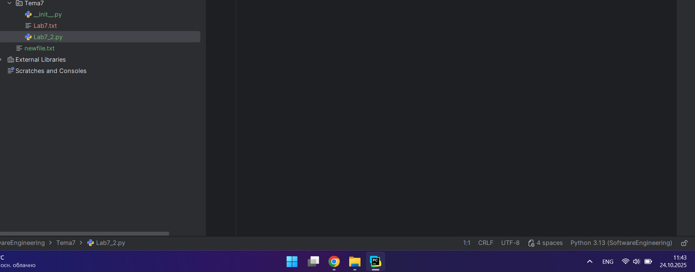

### Выводы

создала текстовый файл в папке с файлами .py

## Лабораторная работа №2
### Напишите программу, которая выведет только первую строку из вашего файла, при этом используйте конструкцию open()/close().

```python
f = open(r'Lab7.txt', encoding='utf-8')
print(f.readline())
f.close()
```
### Результат.

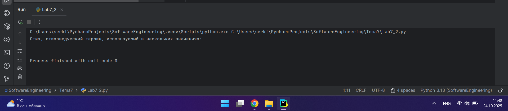

### Выводы

Используя open, мы открываем файл и также для чтения русских символов добавляем кодировку. print(f.readline()) позволяет считать строку и вывести её.

## Лабораторная работа №3
### Напишите программу, которая выведет все строки из вашего файла в массиве, при этом используйте конструкцию open()/close().

```python
f = open(r'Lab7.txt', encoding='utf-8')
print(f.readlines())
f.close()
```
### Результат.

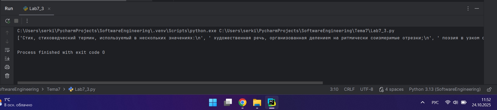

### Выводы

`f.readlines()` позволяет считать все строки файла и поместить в массив.
  
## Лабораторная работа №4
### Напишите программу, которая выведет все строки из вашего файла в массиве, при этом используйте конструкцию with open().


```python
with open('Lab7.txt', encoding='utf-8') as f:
    print(f.readlines())
```
### Результат.

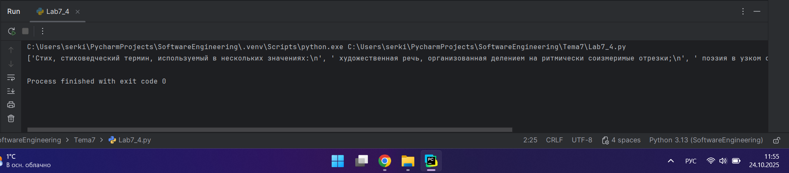

### Выводы

with open('Lab7.txt', encoding='utf-8') as f: возможно открыть файл используя данную конструкцию.

## Лабораторная работа №5
### Напишите программу, которая выведет каждую строку из вашего файла отдельно, при этом используйте конструкцию with open().

```python
with open('Lab7.txt', encoding='utf-8') as f:
    for line in f:
        print(line)
```
### Результат.

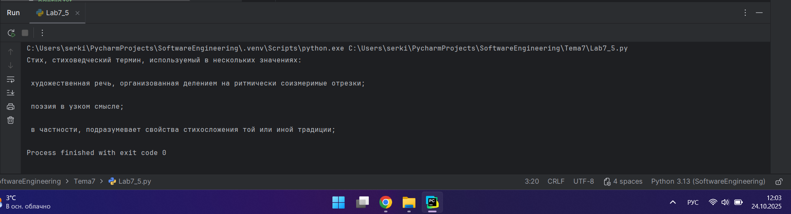

### Выводы

Для того чтобы вывести все строки отдельно мы будем использовать цикл for, где проходимся по каждой строке по порядку.

## Лабораторная работа №6
### Напишите программу, которая будет добавлять новую строку в ваш файл, а потом выведет полученный файл в консоль. Вывод можно осуществлять любым способом. Обязательно проверьте сам файл, чтобы изменения в нем тоже отображались.

```python
with open('Lab7.txt', 'a+', encoding='utf-8') as f:
    f.write( '\nСтрока стихотворного текста, организованная по определённому ритмическому образцу')

with open(r'Lab7.txt', encoding='utf-8') as f:
    result = f.readlines()
    print(result)
```
### Результат.

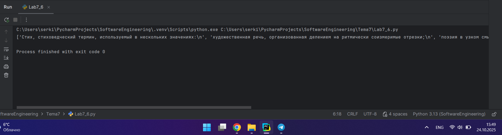
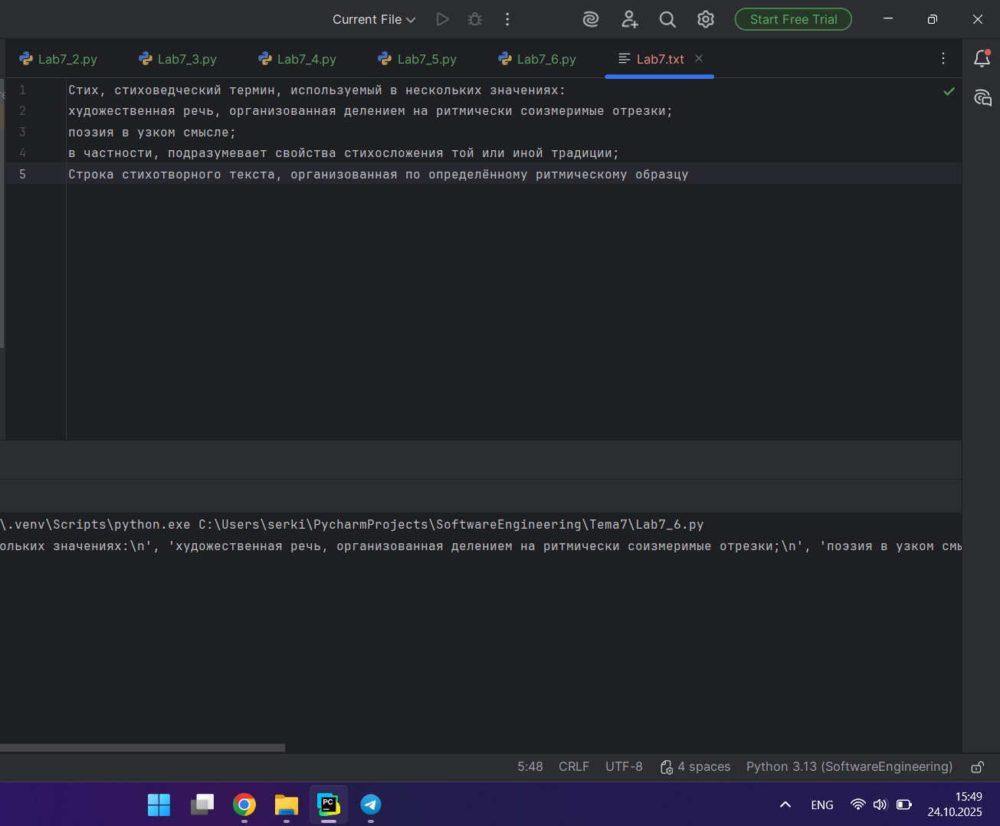

### Выводы

with open('Lab7.txt', 'a+', encoding='utf-8') as f: мы добавляем строку в файл;
with open(r'Lab7.txt', encoding='utf-8') as f: происходит чтение всего текста из файла уже с добавленной строкой.

## Лабораторная работа №7
### Напишите программу, которая перепишет всю информацию, которая была у вас в файле до этого, например напишет любые данные из произвольно вами составленного списка. Также не забудьте проверить что измененная вами информация сохранилась в файле.

```python
lines = ['one', 'two', 'three']
with open('Lab7.txt', 'w') as f:
    for line in lines:
        f.write('\nCycle run ' + line)
    print('Done!')
```
### Результат.

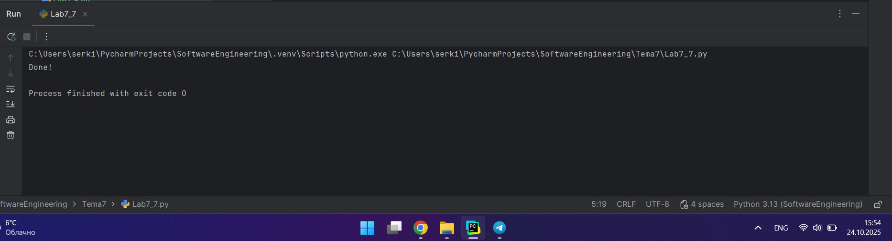
# До
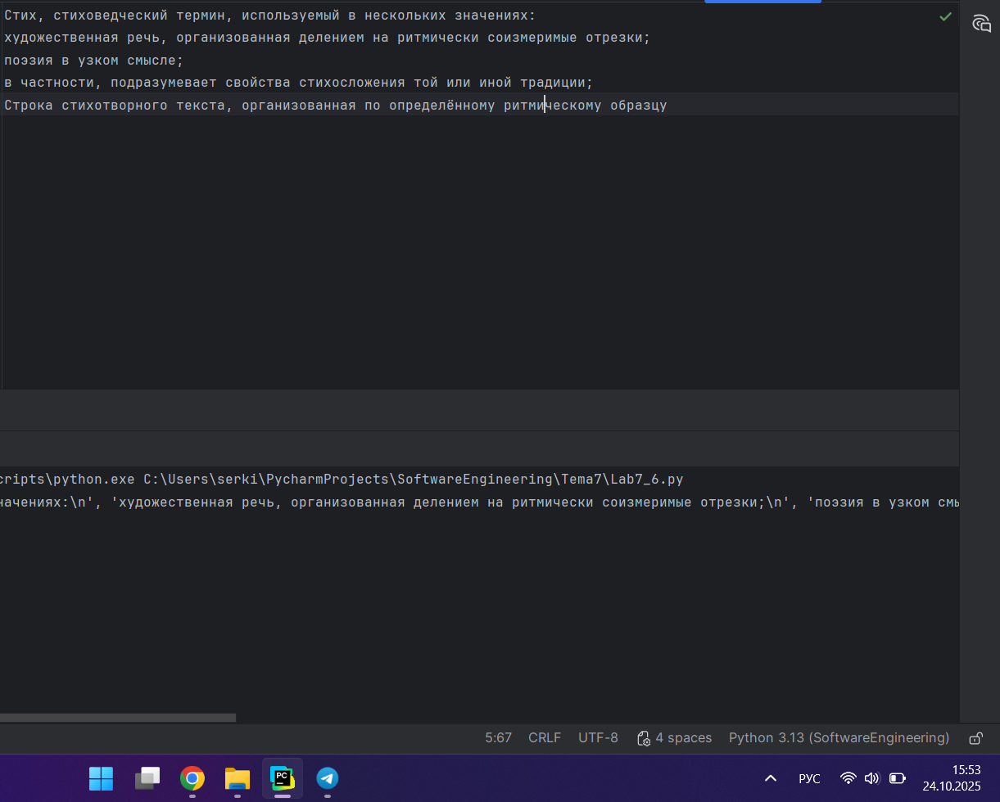
# После
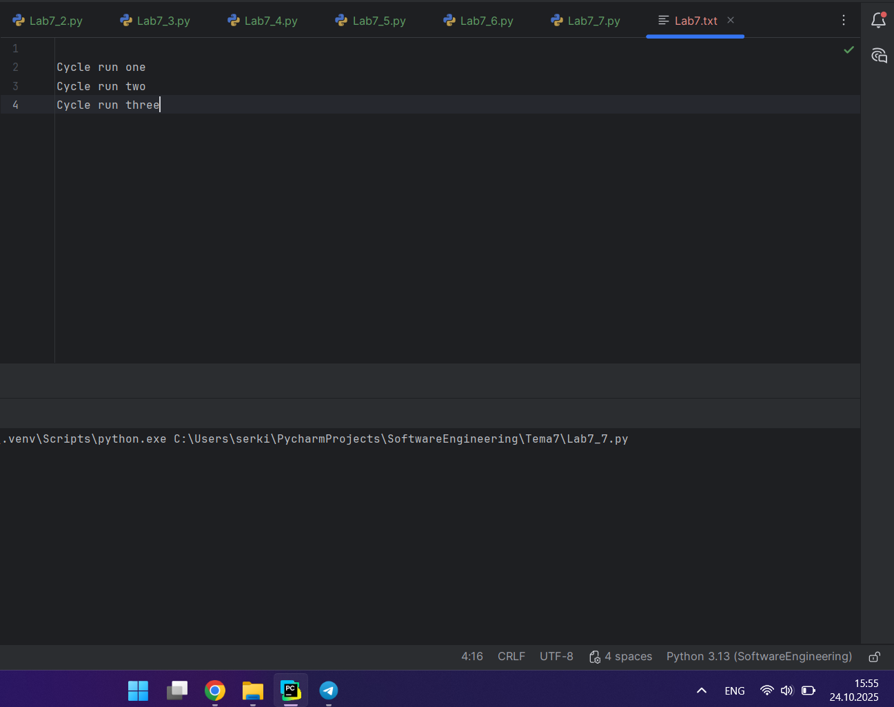

### Выводы

with open('Lab7.txt', 'w') as f: для перезаписи файла в качестве аргумента используем 'w'.

## Лабораторная работа №8
### Выберите любую папку на своем компьютере, имеющую вложенные директории. Выведите на печать в терминал ее содержимое, как и всех подкаталогов при помощи функции print_docs(directory).

```python
import os

def print_docs(directory):
    all_files = os.walk(directory)
    for catalog in all_files:
        print(f'Папка {catalog[0]} содержит:')
    print(f'Директории: {", ".join([folder for folder in catalog[1]])}')
    print(f'Файлы: {", ".join([file for file in catalog[2]])}')
    print('-' * 48)

print_docs(r"C:\Users\serki\OneDrive\Документы\Вуз\Программная Инженерия\Тема7")
```
### Результат.

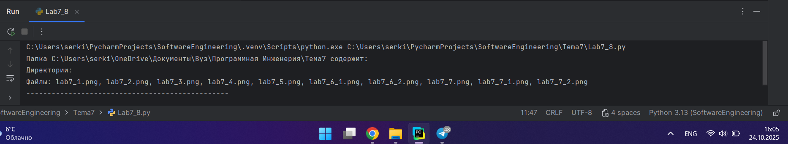

### Выводы

Данная функция выводит все папки и файлы в директории.

## Лабораторная работа №9
### Документ «input.txt» содержит следующий текст: 
### Приветствие
### Спасибо
### Извините
### Пожалуйста
### До свидания
### Ты готов?
### Как дела?
### С днем рождения!
### Удача!
### Я тебя люблю.
### Требуется реализовать функцию, которая выводит слово, имеющее максимальную длину (или список слов, если таковых несколько). Проверьте работоспособность программы на своем наборе данных

```python
def longest_words(file):
    with open(file, encoding='utf-8') as f:
        words = f.read().split()
        max_length = len(max(words, key=len))
        for word in words:
            if len(word) == max_length:
                sought_words = word

        if len(sought_words) == 1:
            return sought_words[0]
        return sought_words

print(longest_words('input.txt'))
```
### Результат.

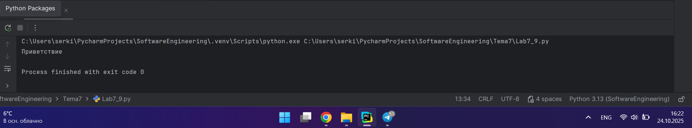

### Выводы

Программа перебирает все строки, делит их на слова и проверяет длину. Если длинна слова максимальна, это слово выводится в консоль.

## Лабораторная работа №10
### Требуется создать csv-файл «rows_300.csv» со следующими столбцами:
### • № - номер по порядку (от 1 до 300);
### • Секунда – текущая секунда на вашем ПК;
### • Микросекунда – текущая миллисекунда на часах.
### Для наглядности на каждой итерации цикла искусственно приостанавливайте скрипт на 0,01 секунды.

```python
import csv
import datetime
import time

with open('rows_300.csv', 'w', encoding='utf-8', newline='') as f:
    writer = csv.writer(f)
    writer.writerow(['№', 'Секунда', 'Микросекунда'])
    for line in range(1, 301):
        writer.writerow([line, datetime.datetime.now().second,
                         datetime.datetime.now().microsecond])
        time.sleep(0.01)
```
### Результат.

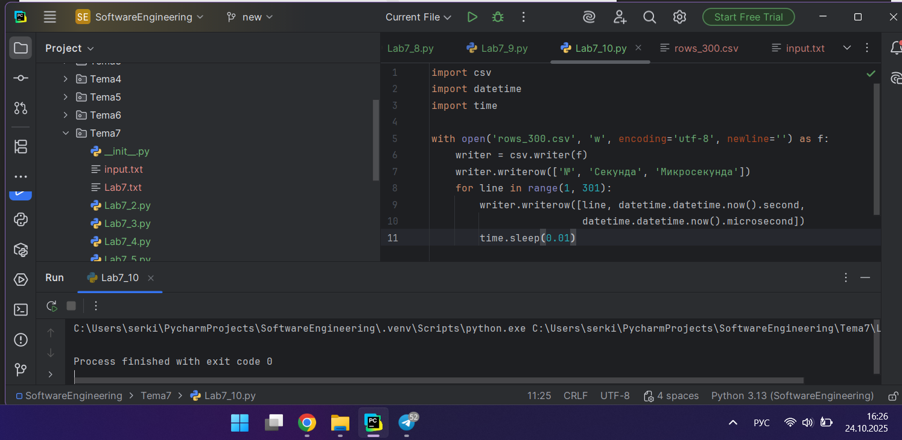
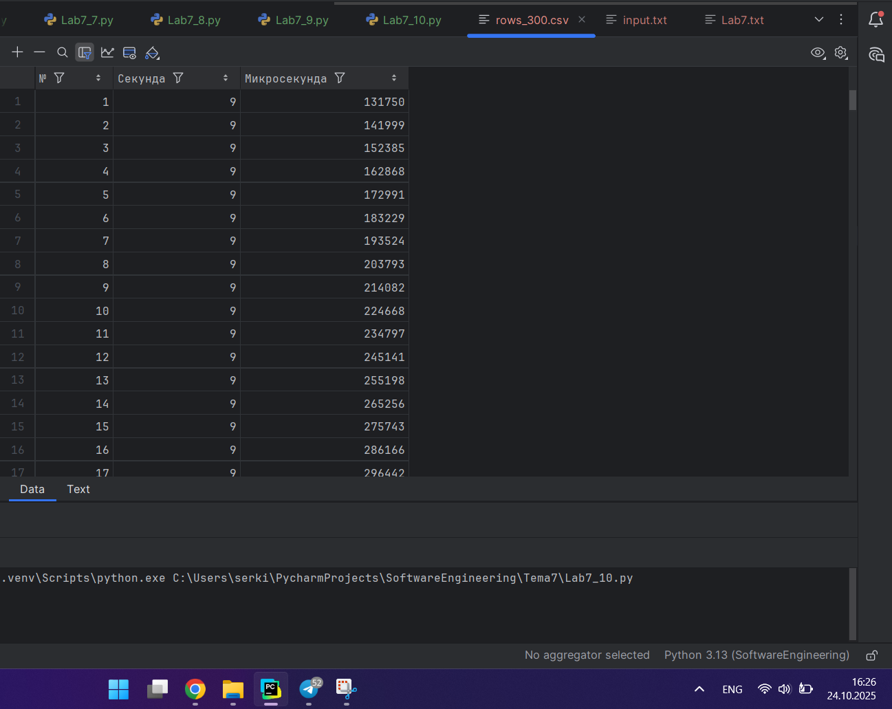

### Выводы

Создается файл в который по столбцам записывается номер, секунда и милисекунда. Для этого используются библиотеки: csv, datetime, time. Файл был создан в формате .csv, который является текстовым форматом для хранения табличных данных, где каждая строка представляет собой строку таблицы, а значения в ней разделены запятыми.

## Самостоятельная работа №1
### Найдите в интернете любую статью (объем статьи не менее 200 слов), скопируйте ее содержимое в файл и напишите программу, которая считает количество слов в текстовом файле и определитсамое часто встречающееся слово. Результатом выполнения задачи будет: скриншот файла со статьей, листинг кода, и вывод в консоль, в котором будет указана вся необходимая информация.

```python
from collections import Counter
import re
def count_words_in_file(filename):
    with open(filename, 'r') as file:
        text = file.read().lower()
        words = re.findall(r'\b\w+\b', text)
        word_count = Counter(words)
        most_common_word = word_count.most_common(1)[0]
    return len(words), most_common_word

total_words, most_common_word = count_words_in_file("banana.txt")
print(f"Общее количество слов: {total_words}")
print(f"Самое частое слово: '{most_common_word[0]}', количество вхождений: {most_common_word[1]}")
```
### Результат.

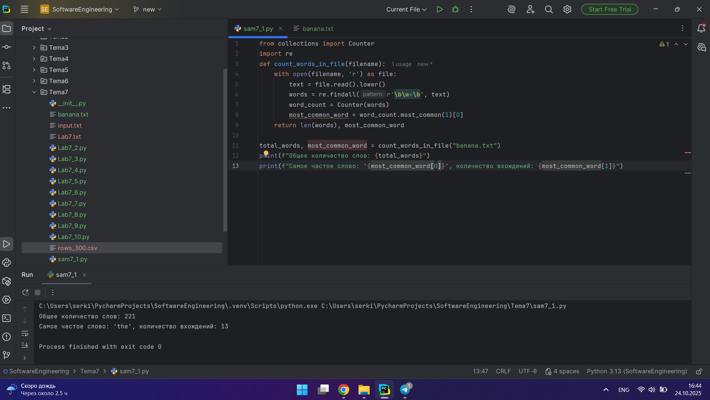
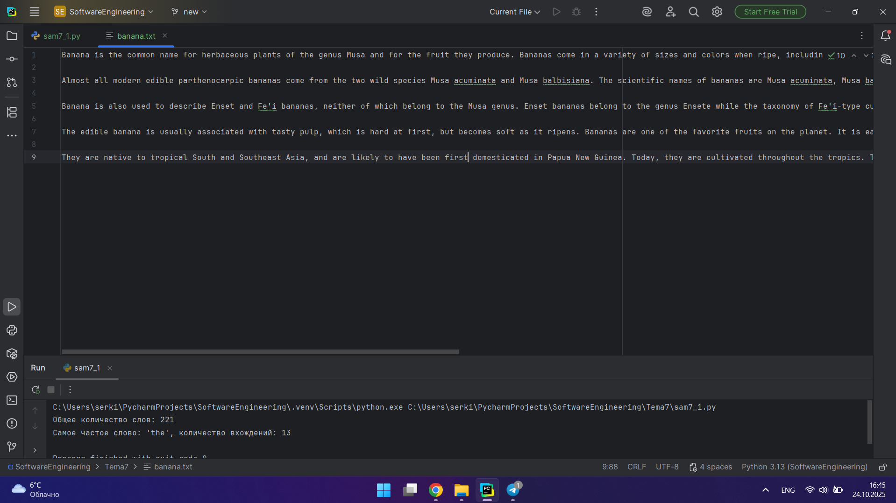

### Выводы

1. text = file.read().lower() записываем из файла текст и переводим его в низний регистр;
2. words = re.findall(r'\b\w+\b', text) извлекаем из текста регулярные выражения соответсвующие патерну, в данном случае \b\w+\b, на выходе получается список;
3. word_count = Counter(words) подсчитываем количество вхождений каждого слова;
4. most_common_word = word_count.most_common(1)[0] выводим самое часто встречаемое слово.
  
## Самостоятельная работа №2
### У вас появилась потребность в ведении книги расходов, посмотрев все существующие варианты вы пришли к выводу что вас ничего не устраивает и нужно все делать самому. Напишите программу для учета расходов. Программа должна позволять вводить информацию о расходах, сохранять ее в файл и выводить существующие данные в консоль. Ввод информации происходит через консоль. Результатом выполнения задачи будет: скриншот файла с учетом расходов, листинг кода, и вывод в консоль, с демонстрацией работоспособности программы.

```python
def add_expense(filename):
    while True:
        expense = input("Введите описание расхода и сумму: ")
        if expense.lower() == 'выйти':
            break
        if expense.strip():
            with open(filename, 'a', encoding='utf-8') as file:
                file.write(expense + "\n")
def show_expenses(filename):
    with open(filename, 'r', encoding='utf-8') as file:
        expenses = file.readlines()
        if expenses:
            print("Ваши расходы:")
            for expense in expenses:
                print(expense.strip())
        else:
            print("Расходов нет.")

filename = "expenses.txt"
add_expense(filename)
show_expenses(filename)
```
### Результат.

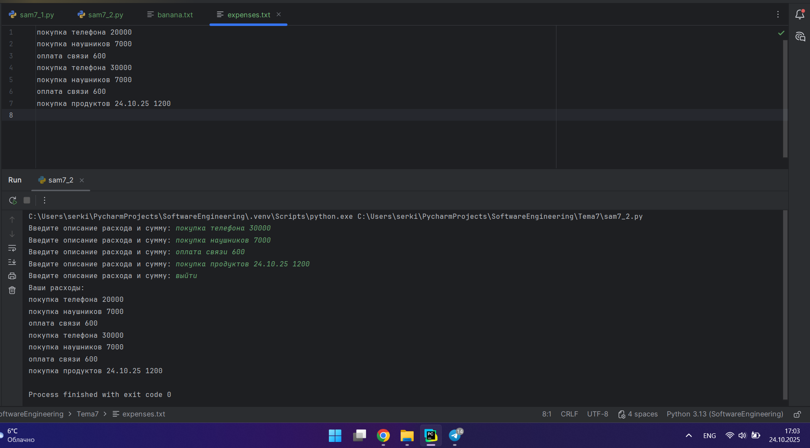

### Выводы

Создаем цикл, корый позволяет вводить и записывать в файл все расходы, пока пользователь не напишет выйти. 
1. file.write(expense + "\n") записываем в файл;
2. expenses = file.readlines() выводим в консоль содержимое файла.
  
## Самостоятельная работа №3
### Имеется файл input.txt с текстом на латинице. Напишите программу, которая выводит следующую статистику по тексту: количество букв латинского алфавита; число слов; число строк.
### • Текст в файле:
### Beautiful is better than ugly.
### Explicit is better than implicit.
### Simple is better than complex.
### Complex is better than complicated.
### • Ожидаемый результат:
### Input file contains:
### 108 letters
### 20 words
### 4 lines

```python
import re

def text_statistics(filename):
    with open(filename, 'r', encoding='utf-8') as file:
        lines = file.readlines()
        num_lines = len(lines)
        num_words = 0
        num_letters = 0
        for line in lines:
            words = line.split()
            num_words += len(words)
            num_letters += len(re.findall(r'[a-zA-Z]', line))
        print(f"Количество букв латинского алфавита: {num_letters}")
        print(f"Количество слов: {num_words}")
        print(f"Количество строк: {num_lines}")

text_statistics("Sam7.txt")
```
### Результат.

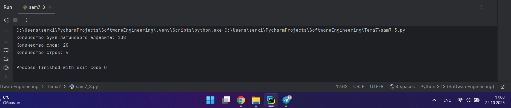

### Выводы

1. `lines = file.readlines()` считываем все строки в файле;
2. `words = line.split()` необходимо разбить строки на слова;
3. `num_words += len(words)` подсчитываем количесво слов;
4. `num_letters += len(re.findall(r'[a-zA-Z]', line))` используем регулярное выражение для поиска латинских букв.
  
## Самостоятельная работа №4
### Напишите программу, которая получает на вход предложение, выводит его в терминал, заменяя все запрещенные слова звездочками * (количество звездочек равно количеству букв в слове). Запрещенные слова, разделенные символом пробела, хранятся в текстовом файле input.txt. Все слова в этом файле записаны в нижнем регистре. Программа должна заменить запрещенные слова, где бы они ни встречались, даже в середине другого слова. Замена производится независимо от регистра: если файл input.txt содержит запрещенное слово exam, то слова exam, Exam, ExaM, EXAM и exAm должны быть заменены на ****.
### • Запрещенные слова:
### hello email python the exam wor is
### • Предложение для проверки:
### Hello, world! Python IS the programming language of thE future. My EMAIL is.... PYTHON is awesome!!!!
### • Ожидаемый результат:
### *****, ***ld! ****** ** *** programming language of *** future. My ***** **.... ****** ** awesome!!!!

```python
import re
def load_forbidden_words(filename):
    with open(filename, 'r', encoding='utf-8') as file:
        forbidden_words = file.read().split()
    return forbidden_words
def censor_sentence(sentence, forbidden_words):
    for word in forbidden_words:
        pattern = re.compile(re.escape(word), re.IGNORECASE)
        sentence = pattern.sub('*' * len(word), sentence)
    return sentence
forbidden_words = load_forbidden_words("censored.txt")
sentence = "Hello, world! Python IS the programming language of thE future. My EMAIL is....PYTHON is awesome!!!!"
censored_sentence = censor_sentence(sentence, forbidden_words)
print(censored_sentence)
```
### Результат.

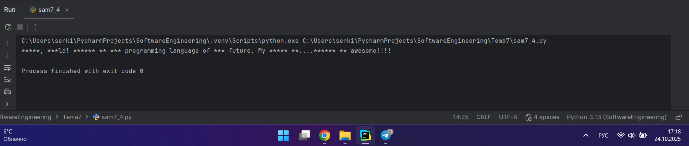

### Выводы

1. `forbidden_words = file.read().split()` разбиваем строку на слова, которые необходимо заменять;
2. `pattern = re.compile(re.escape(word), re.IGNORECASE) создаем регулярное выражение для поиска запрещенных слов независимо от регистра;
3. `sentence = pattern.sub('*' * len(word), sentence)` заменяем запрещённые слова в предложении на звёздочки;
4. `forbidden_words = load_forbidden_words("censored.txt")` для этого подгружаем слова из файла.
  
## Самостоятельная работа №5
### Самостоятельно придумайте и решите задачу, которая будет взаимодействовать с текстовым файлом.
### Дан файл, содержащий произвольный текст. Выяснить, чего в нем больше: русских букв или цифр.

```python
import re

def compare_letters_and_digits(filename):
    with open(filename, 'r', encoding='utf-8') as file:
            text = file.read()
    russian_letters_count = len(re.findall(r'[а-яА-ЯёЁ]', text))
    digits_count = len(re.findall(r'\d', text))
    if russian_letters_count > digits_count:
        return "В файле больше русских букв."
    elif digits_count > russian_letters_count:
        return "В файле больше цифр."
    else:
        return "Количество русских букв и цифр в файле одинаково."

filename = "new.txt"
result = compare_letters_and_digits(filename)
print(result)
```

### Результат.

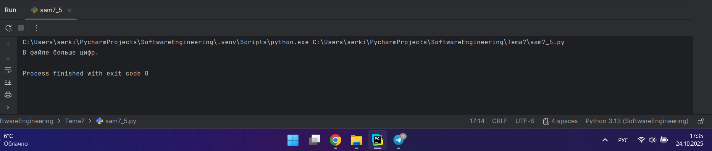

### Выводы

1. text = file.read() считываем текст с файла;
2. russian_letters_count = len(re.findall(r'[а-яА-ЯёЁ]', text)) используем регулярное выражение для подсчёта руских букв;
3. digits_count = len(re.findall(r'\d', text)) используем регулярное выражение для подсчёта цифр;
4. if russian_letters_count > digits_count: выводим результат.

## Общие выводы по теме

В процессе работы я познакомилась с работой с файлами в Python. Изучила чтение из файла, запись в файл и вывод информации о файлах в папках.
