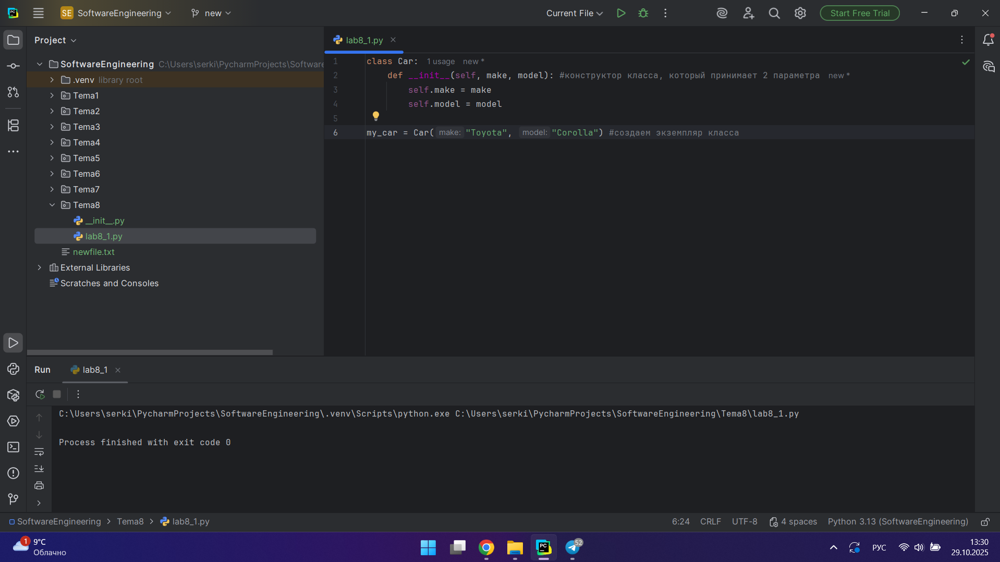
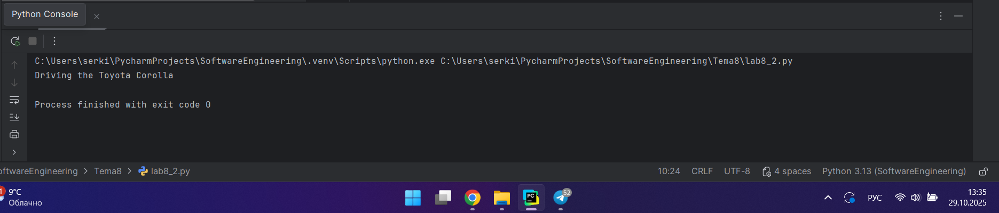
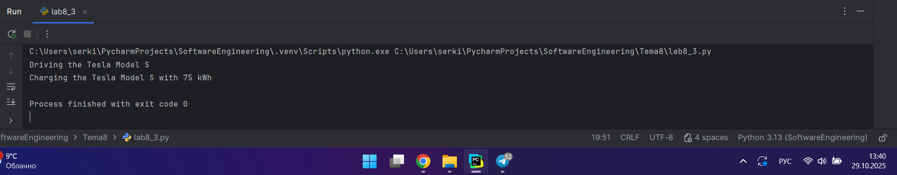
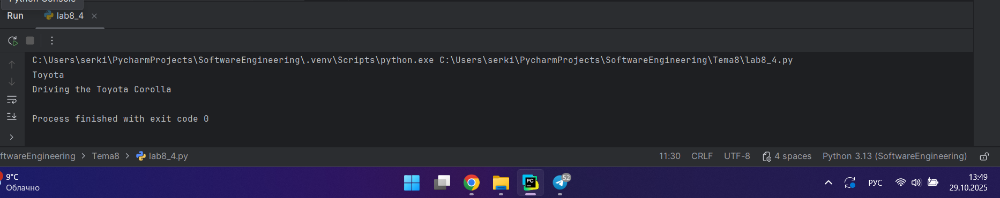
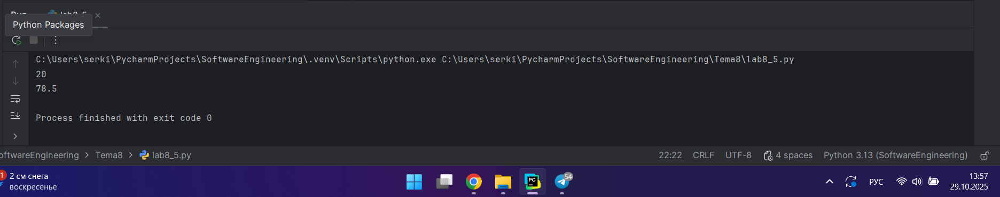
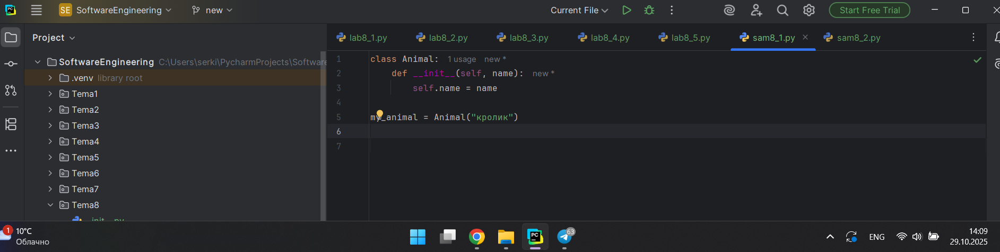
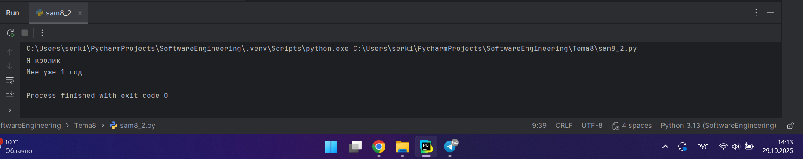
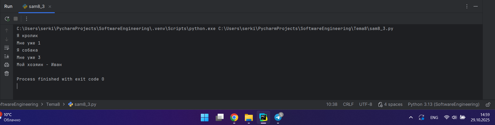
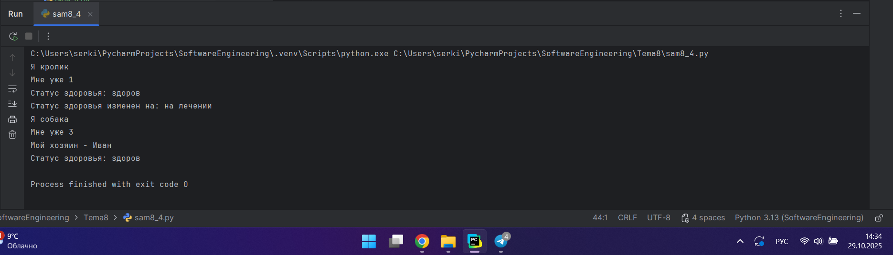
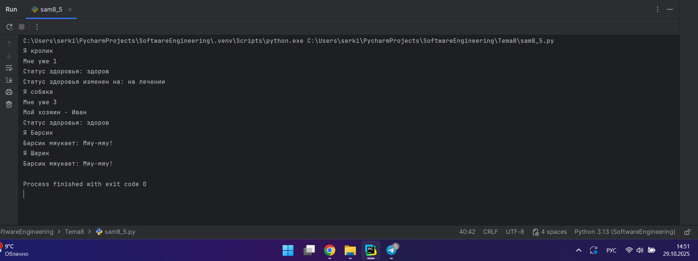

# Тема 8. Основы объектно-ориентированного программирования
Отчет по Теме #8 выполнила:
- Серкина Ксения Кирилловна
- ПИЭ-23-1

| Задание | Лаб_раб | Сам_раб |
| ------ |---------|---------|
| Задание 1 | +       | +       |
| Задание 2 | +       | +       |
| Задание 3 | +       | +       |
| Задание 4 | +       | +       |
| Задание 5 | +       | +       |

знак "+" - задание выполнено; знак "-" - задание не выполнено;

Работу проверили:
- к.э.н., доцент Панов М.А.

## Лабораторная работа №1
### Создайте класс “Car” с атрибутами производитель и модель. Создайте объект этого класса. Напишите комментарии для кода, объясняющие его работу. Результатом выполнения задания будет листинг кода с комментариями.

```python
class Car:
    def __init__(self, make, model): #конструктор класса, который принимает 2 параметра
        self.make = make
        self.model = model

my_car = Car("Toyota", "Corolla") #создаем экземпляр класса
```
### Результат.



### Выводы

Создали класс “Car” с атрибутами производитель и модель, затем добавили экземпляр класса.

## Лабораторная работа №2
### Дополните код из первого задания, добавив в него атрибуты и методы класса, заставьте машину “поехать”. Напишите комментарии для кода, объясняющие его работу. Результатом выполнения задания будет листинг кода с комментариями и получившийся вывод в консоль.

```python
class Car: #объявляем класс
    def __init__(self, make, model): #конструктор класса, который принимает 2 параметра
        self.make = make
        self.model = model

    def drive(self): #добавляем метод класса
        print(f"Driving the {self.make} {self.model}")

my_car = Car("Toyota", "Corolla") #создаем экземпляр класса
my_car.drive() #вызываем метод для созданного объекта 
```
### Результат.


### Выводы

В программу был добавлен метод drive, который вывод сторку в консоль.

## Лабораторная работа №3
### Создайте новый класс “ElectricCar” с методом “charge” и атрибутом емкость батареи. Реализуйте его наследование от класса, созданного в первом задании. Заставьте машину поехать, а потом заряжаться. Результатом выполнения задания будет листинг кода с комментариями и получившийся вывод в консоль.

```python
class Car:
    def __init__(self, make, model):
        self.make = make
        self.model = model

    def drive(self):
        print(f"Driving the {self.make} {self.model}")

class ElectricCar(Car): # Наследование от Car
    def __init__(self, make, model, battery_capacity):
        super().__init__(make, model) # вызываем конструктор родительского класса
        self.battery_capacity = battery_capacity # добавляем новый атрибут

    def charge(self): #создаем уникальный метод для класса ElectricCar
        print(f"Charging the {self.make} {self.model} with {self.battery_capacity} kWh")

my_electric_car = ElectricCar("Tesla", "Model S", 75)
my_electric_car.drive() # используем унаследованный метод
my_electric_car.charge() # используем собственный метод
```
### Результат.



### Выводы

Создаем новый класс, который наследует методы от Car, “ElectricCar” с методом “charge” и атрибутом емкость батареи.
  
## Лабораторная работа №4
### Реализуйте инкапсуляцию для класса, созданного в первом задании. Создайте защищенный атрибут производителя и приватный атрибут модели. Вызовите защищенный атрибут и заставьте машину поехать. Напишите комментарии для кода, объясняющие его работу. Результатом выполнения задания будет листинг кода с комментариями и получившийся вывод в консоль.

```python
class Car:
    def __init__(self, make, model):
        self._make = make # защищенный атрибут
        self.__model = model # приватный атрибут

    def drive(self):
        print(f"Driving the {self._make} {self.__model}") # метод имеет доступ ко всем атрибутам

my_car = Car("Toyota", "Corolla")
print(my_car._make) # вызова защищенного атрибута
my_car.drive() # вызов метода
```
### Результат.



### Выводы

Добавили инкапсуляцию, сделав атрибуты защищёнными и приватными. Для этого используем разное колличесво нижних подчёркиваний.

## Лабораторная работа №5
### Реализуйте полиморфизм создав основной (общий) класс “Shape”, а также еще два класса “Rectangle” и “Circle”. Внутри последних двух классов реализуйте методы для подсчета площади фигуры. После этого создайте массив с фигурами, поместите туда круг и прямоугольник, затем при помощи цикла выведите их площади. Напишите комментарии для кода, объясняющие его работу. Результатом выполнения задания будет листинг кода с комментариями и получившийся вывод в консоль.

```python
class Shape: # общий класс
    def area(self):
        pass # абстрактный метод

class Rectangle(Shape): # Класс Прямоугольник, наследуется от Shape
    def __init__(self, width, height):
        self.width = width
        self.height = height

    def area(self):
        return self.width * self.height # реализация метода поиска площади для прямоугольника

class Circle(Shape): # класс Круг, наследуется от Shape
    def __init__(self, radius):
        self.radius = radius

    def area(self):
        return 3.14 * self.radius * self.radius # реализация метода поиска площади для круга

# создаем объекты
my_rectangle = Rectangle(5, 4)
my_circle = Circle(5)
# вызываем методы для поиска площади
print(my_rectangle.area())
print(my_circle.area())
```
### Результат.



### Выводы

В коде был реализован полиморфизм, путем создания двух классов и переопределения методов.

## Самостоятельная работа №1
### Самостоятельно создайте класс и его объект. Они должны отличаться, от тех, что указаны в теоретическом материале (методичке) и лабораторных заданиях. Результатом выполнени задания будет листинг кода и получившийся вывод консоли.

```python
class Animal:
    def __init__(self, name):
        self.name = name

my_animal = Animal("кролик")
my_animal.my_name()
```
### Результат.



### Выводы

1. `class Animal:` создаем класс Animal
2. `def __init__(self, name):` конструктор класса
3. `my_animal = Animal("кролик")` создаем объект класса
  
## Самостоятельная работа №2
### Самостоятельно создайте атрибуты и методы для ранее созданного класса. Они должны отличаться, от тех, что указаны в теоретическом материале (методичке) и лабораторных заданиях. Результатом выполнения задания будет листинг кода и получившийся вывод консоли.

```python
class Animal:
    def __init__(self, name, age):
        self.name = name
        self.age = age

    def my_name(self):
        print(f"Я {self.name}")
    def my_age(self):
        print(f"Мне уже {self.age} год")

my_animal = Animal("кролик", 1)
my_animal.my_name()
my_animal.my_age()
```
### Результат.



### Выводы

1. `def __init__(self, name, age)` новый атрибут age;
2. `def my_name(self)` метод, который выводит имя;
3. `def my_age(self)` метод, который выводит возраст.
  
## Самостоятельная работа №3
### Самостоятельно реализуйте наследование, продолжая работать с ранее созданным классом. Оно должно отличаться, от того, что указано в теоретическом материале (методичке) и лабораторных заданиях. Результатом выполнения задания будет листинг кода и получившийся вывод консоли.

```python
class Animal:
    def __init__(self, name, age):
        self.name = name
        self.age = age

    def my_name(self):
        print(f"Я {self.name}")

    def my_age(self):
        print(f"Мне уже {self.age} ")

class DomesticAnimal(Animal):
    def __init__(self, name, age, owner):
        super().__init__(name, age)
        self.owner = owner

    def my_owner(self):
        print(f"Мой хозяин - {self.owner}")


my_animal = Animal("кролик", 1)
my_domestic = DomesticAnimal("собака", 3, "Иван")
my_animal.my_name()
my_animal.my_age()
my_domestic.my_name()
my_domestic.my_age()
my_domestic.my_owner()
```
### Результат.



### Выводы

Я создала новый класс DomesticAnimal , который наследуется от Animal. В этом классе был создан новый атрибут owner и метод my_owner.

## Самостоятельная работа №4
### Самостоятельно реализуйте инкапсуляцию, продолжая работать с ранее созданным классом. Она должна отличаться, от того, что указана в теоретическом материале (методичке) и лабораторных заданиях. Результатом выполнения задания будет листинг кода и получившийся вывод консоли.

```python
class Animal:
    def __init__(self, name, age):
        self._name = name
        self._age = age
        self.__health_status = "здоров"


    def my_name(self):
        print(f"Я {self._name}")

    def my_age(self):
        print(f"Мне уже {self._age} ")

    def get_health_status(self):
        return self.__health_status

    def set_health_status(self, status):
        allowed_statuses = ["здоров", "болен", "на лечении"]
        if status in allowed_statuses:
            self.__health_status = status
            print(f"Статус здоровья изменен на: {status}")
        else:
            print("Недопустимый статус здоровья")

class DomesticAnimal(Animal):
    def __init__(self, name, age, owner):
        super().__init__(name, age)
        self.owner = owner

    def my_owner(self):
        print(f"Мой хозяин - {self.owner}")

my_animal = Animal("кролик", 1)
my_domestic = DomesticAnimal("собака", 3, "Иван")
my_animal.my_name()
my_animal.my_age()
print(f"Статус здоровья: {my_animal.get_health_status()}")
my_animal.set_health_status("на лечении")
my_domestic.my_name()
my_domestic.my_age()
my_domestic.my_owner()
print(f"Статус здоровья: {my_domestic.get_health_status()}")

```
### Результат.



### Выводы

В коде были изменены атрибуты на защищённые и приватные, добавлен метод для получения статуса здоровья и изменения. Все изменения внесённые в код реализуют инкапсуляцию.
  
## Самостоятельная работа №5
### Самостоятельно реализуйте полиморфизм. Он должен отличаться, от того, что указан в теоретическом материале (методичке) и лабораторных заданиях. Результатом выполнения задания будет листинг кода и получившийся вывод консоли.

```python
class Animal:
    def __init__(self, name, age):
        self._name = name
        self._age = age
        self.__health_status = "здоров"

    def my_name(self):
        print(f"Я {self._name}")

    def my_age(self):
        print(f"Мне уже {self._age} ")

    def get_health_status(self):
        return self.__health_status

    def set_health_status(self, status):
        allowed_statuses = ["здоров", "болен", "на лечении"]
        if status in allowed_statuses:
            self.__health_status = status
            print(f"Статус здоровья изменен на: {status}")
        else:
            print("Недопустимый статус здоровья")

      def make_sound(self):
        print(f"{self._name} издает звук")

class DomesticAnimal(Animal):
    def __init__(self, name, age, owner):
        super().__init__(name, age)
        self.owner = owner
    def my_owner(self):
        print(f"Мой хозяин - {self.owner}")

class Cat(DomesticAnimal):
    def __init__(self, name, age, owner, breed):
        super().__init__(name, age, owner)
        self.breed = breed

    def make_sound(self):
        print(f"{self._name} мяукает: Мяу-мяу!")

class Dog(DomesticAnimal):
    def __init__(self, name, age, owner, breed):
        super().__init__(name, age, owner)
        self.breed = breed

    def make_sound(self):
        print(f"{self._name} лает: Гав-гав!")

my_animal = Animal("кролик", 1)
my_domestic = DomesticAnimal("собака", 3, "Иван")
my_animal.my_name()
my_animal.my_age()
print(f"Статус здоровья: {my_animal.get_health_status()}")
my_animal.set_health_status("на лечении")
my_domestic.my_name()
my_domestic.my_age()
my_domestic.my_owner()
print(f"Статус здоровья: {my_domestic.get_health_status()}")
my_cat = Cat("Барсик", 3, "Мария", "сиамский")
my_cat.my_name()
my_cat.make_sound()
my_dog = Dog("Шарик", 4, "Петр", "овчарка")
my_dog.my_name()
my_cat.make_sound()
```

### Результат.



### Выводы

Добавляем новые классы и новый метод make_sound. В новых классах он будет переопределён, что позволяет создать полиморфизм.

## Общие выводы по теме

В данной теме изучались возможности реализации объектно-ориентированного подхода на Python. Задания были посвящены сазданию классов, их методов и атрибутов. Такде были реализованны особенности объектно-ориентированного программирования в виде наследования, инкапсуляции и полиморфизма.

